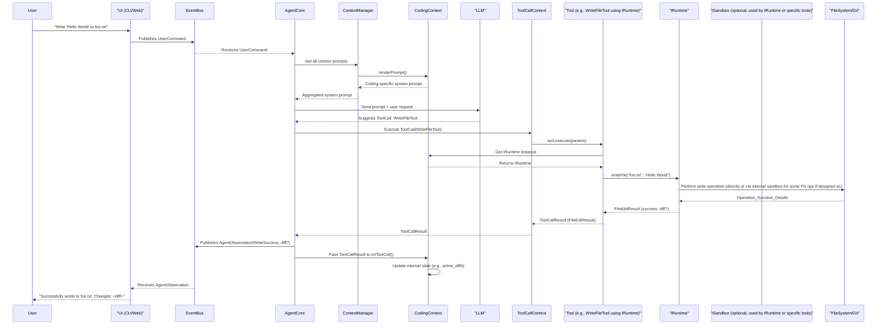

# HHH-AGI Coding Agent: Development Plan

## 1. Introduction & Goals

This document outlines the plan to develop an advanced Coding Agent within the HHH-AGI framework. The agent will be capable of understanding user requests related to code, reading and modifying files, executing code in a sandboxed environment, and interacting with version control systems.

**Core Goals:**

1.  **Effective Code Comprehension & Generation:** Leverage LLMs to understand coding tasks and generate/modify code accurately.
2.  **Robust File System Interaction:** Reliably read, write, and manage files and directories via a runtime interface.
3.  **Flexible Code Editing Strategies:** Support multiple strategies for applying changes to code, leveraging runtime capabilities.
4.  **Safe Code Execution:** Provide a sandboxed environment for direct command execution and a runtime environment for broader, potentially sandboxed, operations.
5.  **Version Control Integration:** Utilize Git for tracking changes, understanding context, and enabling robust rollback.
6.  **User-Friendly Interfaces:** Offer both CLI and Web interfaces for interaction.
7.  **Seamless Integration with HHH-AGI Core:** Build upon the existing Context, Tool, ToolSet, and MCP integration architecture.
8.  **Modularity and Extensibility:** Design components that are easy to maintain, test, and extend.

## 2. Product Vision

The HHH-AGI Coding Agent aims to be a versatile and intelligent partner for software development tasks. It will function as:

*   A **CLI Coding Assistant**: Directly assisting users with coding tasks in their terminal, similar to `aider-chat` or `Codex CLI`.
*   An **Autonomous Task Executor**: Capable of handling more complex, multi-step coding tasks with a higher degree of autonomy, drawing inspiration from agents like Devin and OpenHands.

The agent will empower developers by automating repetitive tasks, assisting with complex changes, and providing intelligent suggestions.

## 3. High-Level Plan & Phases

**Phase 1: Core Coding Engine**
    *   Implement `FileSystemTools` using an `IRuntime` interface (e.g., read, write, list, stat).
    *   Develop initial `EditingStrategyTools` using `IRuntime` (e.g., Whole File, Aider-style Edit Block).
    *   Integrate an `ISandbox` for direct secure shell command execution.
    *   Develop an `IRuntime` implementation that can perform file operations and optionally use an `ISandbox` for its execution methods.
    *   Develop a `CodingContext` to manage state and provide coding tools that utilize `IRuntime` and `ISandbox` appropriately.
    *   Basic CLI for interaction.

**Phase 2: Enhanced Editing & Git Integration**
    *   Refine and add more editing strategies to `EditingStrategyTools` using `IRuntime` (e.g., OpenHands-style ranged edits, Unified Diff).
    *   Implement robust `GitTools` (diff, status, log, commit, apply), potentially using `IRuntime.execute()` or direct `ISandbox` for Git CLI commands.
    *   `CodingContext` to utilize Git for change tracking and context.

**Phase 3: Advanced Agent Capabilities & Runtime**
    *   Develop more sophisticated `IRuntime` implementations (e.g., Docker-based, with finer-grained controls over file access and execution).
    *   Implement code execution capabilities (`IRuntime.executeCode()`).
    *   Enhance agent's planning and task decomposition for coding tasks.
    *   Introduce an Event Bus for decoupled communication.

**Phase 4: User Interfaces & Usability**
    *   Develop a web interface.
    *   Improve CLI usability and features.
    *   User feedback and iteration.

## 4. Proposed Architecture

The Coding Agent will be built upon the existing HHH-AGI architecture, introducing new specialized components.

### 4.1. System Architecture Diagram

```mermaid
graph TD
    User --> UserInterface["CLI / Web UI"]
    UserInterface --> AgentCore
    AgentCore -->|Task| LLM_Node["LLM (e.g., GPT, Claude)"]
    LLM_Node -->|Code/Actions| AgentCore

    CLI_Client["CLI Client"]
    WebUI_Client["Web UI Client"]

    subgraph AgentCore
        direction LR
        ContextManager --> MainWorkflow
        MainWorkflow --> CodingContext
        MainWorkflow --> ToolCallContext
        MainWorkflow --> EventBus
    end

    CodingContext -->|Provides| CodingToolSet
    CodingToolSet --> FileSystemTools
    CodingToolSet --> EditingStrategyTools
    CodingToolSet --> GitTools
    CodingToolSet --> RuntimeTools // For general command execution via IRuntime
    CodingToolSet --> BashTools    // For direct, secure command execution via ISandbox

    ToolCallContext -->|Executes| FileSystemTools
    ToolCallContext -->|Executes| EditingStrategyTools
    ToolCallContext -->|Executes| GitTools
    ToolCallContext -->|Executes| RuntimeTools
    ToolCallContext -->|Executes| BashTools

    FileSystemTools -->|Uses| IRuntimeInterface["IRuntime"]
    EditingStrategyTools -->|Uses| IRuntimeInterface
    RuntimeTools -->|Uses| IRuntimeInterface
    
    IRuntimeInterface -- optional internal use --> ISandboxInterface["ISandbox"]
    BashTools -->|Uses| ISandboxInterface

    IRuntimeInterface -- interacts with --> FileSystem_Node["File System (Workspace)"]
    ISandboxInterface -- executes in --> IsolatedEnvironment["Isolated Environment"]
    
    GitTools -->|Uses Git CLI via| IRuntimeInterface # or ISandboxInterface

    EventBus -->|Events| CLI_Client
    EventBus -->|Events| WebUI_Client
    CLI_Client -->|Commands| EventBus
    WebUI_Client -->|Commands| EventBus

    classDef existing fill:#lightgrey,stroke:#333,stroke-width:2px;
    classDef newComponent fill:#lightblue,stroke:#333,stroke-width:2px;
    classDef interfaceDef fill:#lightyellow,stroke:#333,stroke-width:2px;

    class AgentCore,ContextManager,ToolCallContext,EventBus,LLM_Node existing;
    class CodingContext,CodingToolSet,FileSystemTools,EditingStrategyTools,GitTools,RuntimeTools,BashTools,CLI_Client,WebUI_Client,MainWorkflow,UserInterface,FileSystem_Node,IsolatedEnvironment newComponent;
    class IRuntimeInterface,ISandboxInterface interfaceDef;
```

### 4.2. Core Components

1.  **`CodingContext` (New)**:
    *   **Description**: A specialized `IContext` responsible for managing the state relevant to coding tasks. This includes currently "open" files (or files in focus), diffs, selected editing strategies, and providing access to the `IRuntime` and `ISandbox` instances.
    *   **Data**:
        *   `current_workspace`: Path to the root of the project.
        *   `open_files`: A map of file paths to their content or metadata (e.g., last read, hash).
        *   `active_diffs`: Diffs generated by Git or editing tools.
        *   `selected_editing_strategy`: The current default strategy.
    *   **Methods**:
        *   `getRuntime(): IRuntime`: Provides the configured runtime instance.
        *   `getSandbox(): ISandbox`: Provides the configured sandbox instance.
    *   **`toolSetFn()`**: Returns the `CodingToolSet`.
    *   **`onToolCall()`**: Updates its state based on the results of file operations, Git commands, or edits. For example, after a tool using `IRuntime.writeFile()` call, it might update `open_files` or store the returned `diff` in `active_diffs`.
    *   **`renderPrompt()`**: Provides relevant coding context to the LLM, such as a list of open files, recent changes, or available coding tools and their current state, including the type of sandbox available.

2.  **`CodingToolSet` (New)**:
    *   **Description**: A `ToolSet` provided by `CodingContext`. It groups all tools related to coding.
    *   **Tools**:
        *   `FileSystemTools`: For direct file/directory manipulation using `IRuntime`.
        *   `EditingStrategyTools`: For applying code changes using various strategies via `IRuntime`.
        *   `GitTools`: For interacting with Git, potentially using `IRuntime.execute()` or `ISandbox.executeSecurely()` for CLI commands.
        *   `RuntimeTools`: For executing general commands or code snippets using `IRuntime.execute()` or `IRuntime.executeCode()`.
        *   `BashTools` (example): For executing specific bash commands requiring direct `ISandbox` access and fine-grained control.

3.  **File System Tools (`ITool` implementations, use `IRuntime`) (New)**:
    *   These tools leverage the `IRuntime` interface methods (`readFile`, `writeFile`, `listDirectory`, `getFileStatus`, `deleteFile`, `createDirectory`).
    *   Example: `WriteFileTool` would call `IRuntime.writeFile()` and handle the `FileEditResult`.
    *   All paths are resolved relative to `CodingContext.current_workspace`.

4.  **Editing Strategy Tools (`ITool` implementations, use `IRuntime`) (New)**:
    *   These tools utilize the editing methods on the `IRuntime` interface.
    *   **`ApplyEditBlockTool`**: Calls `IRuntime.applyEditBlock()`.
        *   Params: `path: string`, `search_block: string`, `replace_block: string`, `options: CodeBlockMatchOptions?`
        *   Returns: `FileEditResult`
    *   **`ApplyWholeFileEditTool`**: Primarily uses `IRuntime.writeFile()` with overwrite mode, but can also use `IRuntime.generateDiff()` to produce the diff.
        *   Params: `path: string`, `content: string`
        *   Returns: `FileEditResult` (diff included)
    *   **`ApplyUnifiedDiffTool`**: Calls `IRuntime.applyUnifiedDiff()`.
        *   Params: `path: string`, `diff_content: string`
        *   Returns: `FileEditResult`
    *   **`ApplyRangedEditTool`**: Calls `IRuntime.applyRangedEdit()`.
        *   Params: `path: string`, `content_to_apply: string`, `start_line: int`, `end_line: int`, `options?`
        *   Returns: `FileEditResult`

5.  **Git Tools (`ITool` implementations) (New)**:
    *   These tools might wrap Git CLI commands. They can use `IRuntime.execute()` for this, allowing the runtime to manage the execution context (e.g., CWD, environment). For stricter isolation or specific sandbox profiles, they could alternatively use `ISandbox.executeSecurely()`.
    *   Examples: `GitStatusTool`, `GitDiffTool`, `GitLogTool`, `GitCommitTool`, `GitAddTool`.
    *   `CodingContext` may use `GitDiffTool` (which uses `IRuntime.generateDiff` or `IRuntime.execute` with `git diff`) results.

6.  **Runtime Tools (`ITool` implementations, use `IRuntime`) (New)**:
    *   **`ExecuteShellCommandTool`**:
        *   Params: `command: string`, `cwd: string?`, `timeout_ms: int?`, `writable_paths: string[]?`, `allow_network: bool?`
        *   Calls `IRuntime.execute(command, options)`. The `IRuntime` implementation would then decide how to execute this, potentially using its configured `ISandbox`.
        *   Returns: `ShellExecutionResult` (`stdout`, `stderr`, `exit_code`, `error?`)
    *   **`ExecuteCodeTool` (Phase 3)**:
        *   Params: `language: string`, `code: string`, `timeout_ms: int?`, `env: Record<string,string>?`
        *   Calls `IRuntime.executeCode(language, code, options)`.
        *   Returns: `{stdout, stderr, exitCode, resultData?}`

7.  **`ISandbox` Interface (New/Defined)**:
    *   **Description**: Provides a mechanism for executing shell commands with security isolation. This is for tools that need direct, fine-grained control over sandboxed execution.
    *   **Interface (`src/core/contexts/coding/sandbox/interface.ts`)**:
        *   `executeSecurely(command: string, options?: ExecutionOptions): Promise<ShellExecutionResult>`
        *   `type: "none" | "seatbelt" | "landlock"` (or other sandbox types)
    *   **`ExecutionOptions`**: `cwd?`, `timeout?`, `writablePaths?`, `env?`, `allowNetwork?`.
    *   Used by: Tools like `BashCommandTool` or potentially by `GitTools` if very specific sandboxing is needed for Git CLI calls. Also, an `IRuntime` implementation *can* use an `ISandbox` internally for its `execute` or `executeCode` methods.

8.  **`IRuntime` Interface (New/Defined)**:
    *   **Description**: An execution environment that offers a comprehensive suite of operations needed for coding tasks, including file system interactions, various code editing methods, diff generation, and general command/code execution. An `IRuntime` implementation can choose to use an `ISandbox` for its execution-related methods.
    *   **Interface (`src/core/contexts/coding/runtime/interface.ts`)**:
        *   File operations: `readFile`, `writeFile` (returns `FileEditResult`), `listDirectory`, `getFileStatus`, `deleteFile`, `createDirectory`.
        *   Editing operations: `applyEditBlock`, `applyRangedEdit`, `applyUnifiedDiff` (all return `FileEditResult`).
        *   Diff generation: `generateDiff`.
        *   Execution: `execute(command, options): Promise<ShellExecutionResult>`, `executeCode(language, code, options)`.
        *   `type: "node" | "docker" | "vm"` (or other runtime types).
        *   `sandbox?: ISandbox`: The sandbox instance this runtime uses, if any.
        *   `isAvailable(): Promise<boolean>`.
    *   Used by: `FileSystemTools`, `EditingStrategyTools`, `RuntimeTools`.

9.  **Event Bus (New)**:
    *   **Description**: A central messaging system for decoupling components.
    *   **Events**: `UserCommand`, `AgentAction`, `AgentObservation`, `SystemStatusUpdate`, `FileChanged`, `NewDiffAvailable`.
    *   **Consumers/Producers**: AgentCore, UI Clients, `CodingContext`.

### 4.3. Main Workflow Diagram


*If a tool like `BashCommandTool` was called, it would get `ISandbox` from `CodingContext` and call `ISandbox_WF.executeSecurely()`.*

### 4.4. Integrating with Existing Architecture

*   **`IContext`**: `CodingContext` is an implementation of `IContext`.
*   **`ToolSet`**: `CodingToolSet` is provided by `CodingContext`. Tools within use `IRuntime` or `ISandbox` obtained from `CodingContext`.
*   **`ToolCallContext`**: Executes the new coding tools.
*   **`onToolCall`**: `CodingContext` updates its state based on tool results, especially `FileEditResult` containing diffs.

## 5. Detailed Feature Breakdown

### 5.1. Code Editing Strategies (Leveraging `IRuntime`)

1.  **Aider-Style Edit Block (`ApplyEditBlockTool`)**:
    *   LLM generates `filename`, `SEARCH` block, `REPLACE` block, and `CodeBlockMatchOptions`.
    *   Tool calls `IRuntime.applyEditBlock()`.
    *   Returns `FileEditResult`.
2.  **Whole File Edit (`ApplyWholeFileEditTool`)**:
    *   LLM generates `filename` and entire new content.
    *   Tool calls `IRuntime.writeFile()` (mode: `create_or_overwrite`).
    *   `IRuntime.writeFile()` returns `FileEditResult` which should ideally include a diff (implementation detail of `IRuntime`). If not, the tool can use `IRuntime.generateDiff()`.
3.  **Ranged Edit (`ApplyRangedEditTool`)**:
    *   LLM generates `filename`, `content_to_apply`, `start_line`, `end_line`.
    *   Tool calls `IRuntime.applyRangedEdit()`.
    *   Returns `FileEditResult`.
4.  **Unified Diff Application (`ApplyUnifiedDiffTool`)**:
    *   LLM generates a standard unified diff.
    *   Tool calls `IRuntime.applyUnifiedDiff()`.
    *   Returns `FileEditResult`.

**Prompting for Edits**: The system prompt for the LLM will include clear instructions and examples for each supported editing format, referencing the available tools that use the `IRuntime`'s editing capabilities.

### 5.2. File System Operations (Leveraging `IRuntime`)

*   Tools as defined in Section 4.2.3, all delegating to `IRuntime` methods.
*   Paths resolved relative to `CodingContext.current_workspace`.
*   `IRuntime` handles errors and reports back via `FileEditResult` or direct return values.

### 5.3. Git Integration

*   Tools as defined in Section 4.2.5.
*   Can use `IRuntime.execute()` for Git CLI commands. The `IRuntime`'s configured `cwd` (usually workspace root) and potential sandboxing (if its `execute` method uses `ISandbox`) apply.
*   Alternatively, for very specific sandboxing profiles for Git commands, a Git tool could directly use `ISandbox.executeSecurely()`.
*   `CodingContext` uses `GitDiffTool` (which uses `IRuntime.generateDiff` or `IRuntime.execute` with `git diff`) results.

### 5.4. Runtime & Sandboxing

*   **`ISandbox`**: For direct, secure execution of arbitrary shell commands when full control over sandboxing parameters (`writablePaths`, `allowNetwork`, etc.) is needed by the tool itself (e.g., `BashCommandTool`).
*   **`IRuntime`**:
    *   Provides higher-level file system and editing operations.
    *   Its `execute(command, options)` method is for general shell commands where the `IRuntime`'s environment is appropriate. The `IRuntime` implementation (e.g., `NodeJsRuntime`) can internally use its `ISandbox` instance to run these commands.
    *   Its `executeCode(language, code, options)` method behaves similarly for code snippets.
    *   Different `IRuntime` implementations (Node.js, Docker) can offer different levels of isolation and capabilities.

### 5.5. User Interfaces

1.  **CLI**:
    *   Interactive chat loop.
    *   Commands for managing context.
    *   Display of diffs from `FileEditResult`, agent thoughts, tool calls.
2.  **Web UI (Phase 4)**:
    *   Richer display.

### 5.6. Event Bus

*   As described previously.

## 6. Core Interface Snippets (Reflecting Current Design)

```typescript
// In src/core/contexts/coding/sandbox/interface.ts
export interface ShellExecutionResult {
  stdout: string;
  stderr: string;
  exitCode: number | null;
  error?: Error;
}
export interface ExecutionOptions {
  cwd?: string;
  timeout?: number;
  writablePaths?: string[];
  env?: Record<string, string>;
  allowNetwork?: boolean;
}
export interface ISandbox {
  executeSecurely(command: string, options?: ExecutionOptions): Promise<ShellExecutionResult>;
  readonly type: "none" | "seatbelt" | "landlock"; // etc.
}

// In src/core/contexts/coding/runtime/interface.ts
// (CodeBlockMatchOptions, FileEditResult, FileStatus, DirectoryEntry as previously defined)
export interface IRuntime {
  readFile(filePath: string, options?: { encoding?: BufferEncoding; startLine?: number; endLine?: number }): Promise<string>;
  writeFile(filePath: string, content: string, options?: { mode?: 'overwrite' | 'append' | 'create_or_overwrite' | 'overwrite_range'; startLine?: number; endLine?: number; }): Promise<FileEditResult>;
  applyEditBlock(filePath: string, searchBlock: string, replaceBlock: string, options?: CodeBlockMatchOptions): Promise<FileEditResult>;
  applyRangedEdit(filePath: string, contentToApply: string, startLine: number, endLine: number, options?: { preserveUnchangedMarkers?: boolean }): Promise<FileEditResult>;
  applyUnifiedDiff(filePath: string, diffContent: string): Promise<FileEditResult>;
  generateDiff(oldContent: string, newContent: string, options?: { oldPath?: string; newPath?: string }): Promise<string>;
  listDirectory(dirPath: string, options?: { recursive?: boolean; maxDepth?: number }): Promise<DirectoryEntry[]>;
  getFileStatus(filePath: string): Promise<FileStatus>;
  deleteFile(filePath: string): Promise<boolean>;
  createDirectory(dirPath: string, options?: { recursive?: boolean }): Promise<boolean>;
  execute(command: string, options?: ExecutionOptions): Promise<ShellExecutionResult>;
  executeCode(language: string, code: string, options?: { timeout?: number; env?: Record<string, string> }): Promise<{ stdout: string; stderr: string; exitCode: number | null; resultData?: any; }>;
  readonly type: "node" | "docker" | "vm";
  readonly sandbox?: ISandbox;
  isAvailable(): Promise<boolean>;
}
```

## 7. Risks and Mitigation

*   **LLM Hallucination/Incorrect Edits**:
    *   Mitigation: `FileEditResult` provides diffs for review. User confirmation steps. `IRuntime`'s specific editing methods aim for more controlled changes.
*   **Security of `ISandbox` and `IRuntime` Implementations**:
    *   Mitigation: Phased approach. Start with simpler `ISandbox` (e.g., `NoSandbox`, `SeatbeltSandbox`) and `IRuntime` (e.g., `NodeJsRuntime`). Rigorous testing of permissions and isolation.
*   **Complexity of `IRuntime` Editing Implementations**:
    *   Mitigation: Implement and test each `IRuntime` editing method thoroughly.
*   **State Management in `CodingContext`**:
    *   Mitigation: Clear rules for state updates from `FileEditResult` via `onToolCall`.

## 8. Next Steps

1.  **Implement `IRuntime` and `ISandbox` Interfaces**: Ensure they are finalized.
2.  **Implement `NodeJsRuntime`**:
    *   Complete implementations for all `IRuntime` methods, including the actual logic for `applyEditBlock`, `applyRangedEdit`, `applyUnifiedDiff`, and `executeCode` (can be stubbed initially if complex).
    *   Ensure `writeFile` correctly generates and returns diffs in `FileEditResult`.
    *   Integrate `ISandbox` usage within `NodeJsRuntime.execute` and `executeCode`.
3.  **Implement `FileSystemTools` and `EditingStrategyTools`**: Ensure they correctly use the `IRuntime` methods obtained from `CodingContext` and handle `FileEditResult`.
4.  **Implement `RuntimeTools` and `BashTools`**: `RuntimeTools` use `IRuntime.execute/executeCode`. `BashTools` use `ISandbox.executeSecurely`.
5.  **Refine `CodingContext`**: Ensure `onToolCall` properly handles `FileEditResult` (e.g., storing diffs) and `renderPrompt` effectively communicates context state.
6.  **Basic CLI**: For testing and interaction.
7.  **Iterate**: Test, refine, and begin adding more tools and features from Phase 1 & 2.

This plan provides a roadmap for building a powerful and flexible Coding Agent. We will iterate on this plan as development progresses and new insights are gained.

## 9. Testing Strategy (Updated)

We have migrated the entire test harness to **Vitest** for a faster and more modern TypeScript-native experience.  A few highlights:

1.  Use of Vitest's built-in assertion and mocking utilities (`vi.fn`, `vi.spyOn`, `vi.mock`).
2.  Platform‐specific tests are conditionally executed via helpers like:
    ```ts
    const itOnMacOs = os.platform() === 'darwin' ? it : it.skip;
    ```
3.  For macOS Seatbelt sandboxing we run commands against the real `/usr/bin/sandbox-exec` where available, falling back or skipping on other platforms instead of relying on expensive full-module mocks.
4.  Core-module functions (e.g. `os.platform`) are treated as **non-configurable** – tests avoid redefining them and instead rely on wrapper logic or conditional skips.
5.  All tool-level tests (FileSystemTools, EditingStrategyTools, etc.) use lightweight mocks for `IRuntime` and `IAgent` and validate only public contract behaviour.

These conventions are codified in the new `tests/**/*.test.ts` files and should be followed when adding further coverage.
