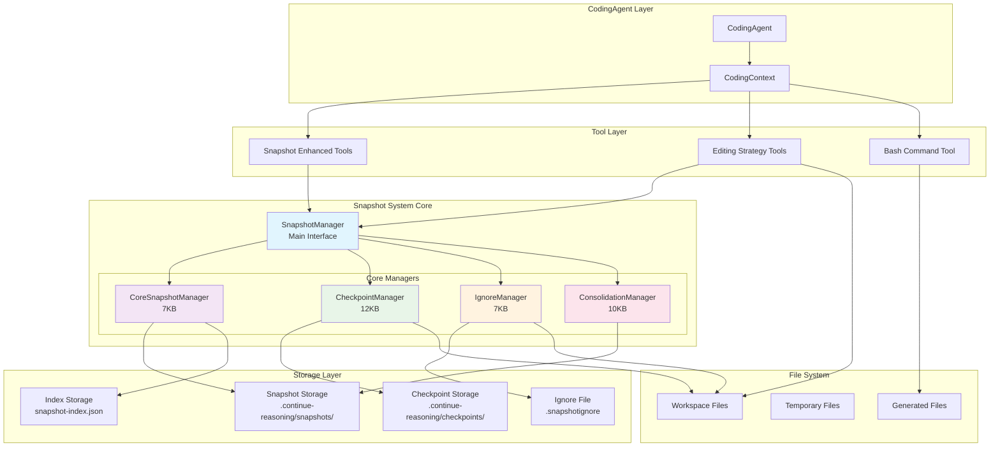
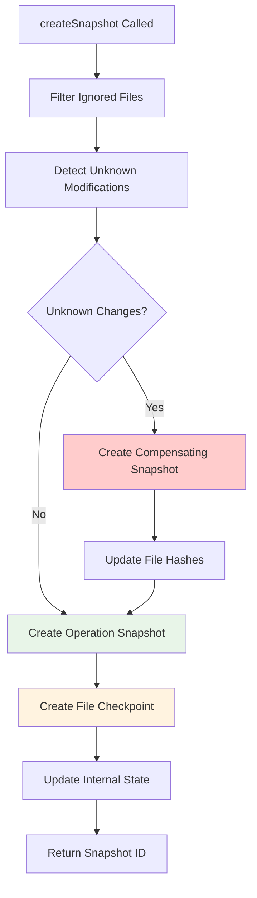
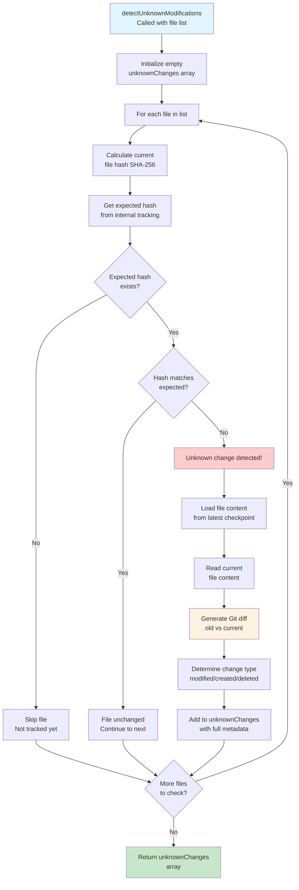

# Complete Snapshot System Documentation

## Table of Contents
1. [Overview](#overview)
2. [Architecture](#architecture)
3. [Core Components](#core-components)
4. [createSnapshot Principle](#createsnapshot-principle)
5. [Unknown Change Detection](#unknown-change-detection)
6. [Consolidation System](#consolidation-system)
7. [Snapshot Ignore System](#snapshot-ignore-system)
8. [Tools and APIs](#tools-and-apis)
9. [Usage Examples](#usage-examples)
10. [Migration Guide](#migration-guide)
11. [Best Practices](#best-practices)

## Overview

The snapshot system provides comprehensive state tracking and change management for development workflows. It captures file modifications, detects external changes, and maintains complete audit trails through a modular, extensible architecture.

### Key Features
- **State Continuity**: Tracks all file modifications with hash-based validation
- **Unknown Change Detection**: Automatically detects and integrates external file modifications
- **Modular Architecture**: Separated concerns for maintainability and extensibility
- **Consolidation System**: Merges multiple snapshots for storage optimization
- **Diff-Driven Development**: Complete Git-compatible diff tracking
- **Ignore System**: Flexible file filtering with .snapshotignore support

## Architecture

### Modular Design Overview

```
SnapshotManager (Main Interface)
├── CoreSnapshotManager (7KB) - Storage & Indexing
├── CheckpointManager (12KB) - Unknown Change Detection
├── IgnoreManager (7KB) - File Filtering
└── ConsolidationManager (10KB) - Snapshot Consolidation
```

### Architecture Diagram



### Component Responsibilities

| Component | Purpose | Key Functions |
|-----------|---------|---------------|
| **SnapshotManager** | Main interface and coordination | Unified API, component orchestration |
| **CoreSnapshotManager** | Basic snapshot operations | Save/load snapshots, indexing, caching |
| **CheckpointManager** | File state tracking | Checkpoints, unknown change detection |
| **IgnoreManager** | File filtering | Pattern matching, ignore rule management |
| **ConsolidationManager** | Snapshot optimization | Merge snapshots, storage optimization |

## Core Components

### 1. CoreSnapshotManager

Handles basic snapshot storage and indexing operations.

```typescript
interface CoreSnapshotManager {
  createSnapshot(data: SnapshotData): Promise<string>;
  loadSnapshot(id: string): Promise<SnapshotData>;
  getLatestSnapshot(): Promise<SnapshotData | null>;
  updateIndex(snapshot: SnapshotData): Promise<void>;
  getCacheStats(): CacheStats;
}
```

**Key Features:**
- Atomic snapshot creation with rollback on failure
- Efficient indexing for fast retrieval
- Memory-optimized caching system
- Concurrent operation safety

### 2. CheckpointManager

Manages file checkpoints and unknown change detection.

```typescript
interface CheckpointManager {
  createFileCheckpoint(snapshotId: string, files: string[]): Promise<void>;
  loadCheckpoint(id?: string): Promise<CheckpointData>;
  detectUnknownModifications(files: string[]): Promise<UnknownChange[]>;
  generateDiff(oldContent: string, newContent: string): string;
}
```

**Key Features:**
- File content snapshots at checkpoint creation
- SHA-256 hash-based change detection
- Git-compatible diff generation
- Automatic cleanup of old checkpoints

### 3. IgnoreManager

Handles file filtering and ignore pattern management.

```typescript
interface IgnoreManager {
  shouldIgnoreFile(filePath: string): boolean;
  filterFiles(files: string[]): string[];
  loadIgnoreRules(): Promise<void>;
  getIgnorePatterns(): string[];
}
```

**Key Features:**
- Glob pattern matching with wildcards
- .snapshotignore file management
- Performance-optimized filtering
- Default ignore patterns for common scenarios

### 4. ConsolidationManager

Manages snapshot consolidation and storage optimization.

```typescript
interface ConsolidationManager {
  consolidateSnapshots(snapshots: string[], strategy: ConsolidationStrategy): Promise<ConsolidationResult>;
  getConsolidationCandidates(): Promise<string[]>;
  getStorageStats(): Promise<StorageStats>;
}
```

**Key Features:**
- Multiple consolidation strategies
- Storage space optimization
- State continuity preservation during merging
- Automatic candidate detection

## createSnapshot Principle

### Core Algorithm

The `createSnapshot` function is the heart of the system, implementing a multi-phase approach:

```typescript
async function createSnapshot(
  tool: string,
  affectedFiles: string[],
  diff: string,
  goal: string
): Promise<string> {
  // Phase 1: Pre-validation and Unknown Change Detection
  const filteredFiles = this.ignoreManager.filterFiles(affectedFiles);
  const unknownChanges = await this.checkpointManager.detectUnknownModifications(filteredFiles);
  
  // Phase 2: Handle Unknown Changes
  if (unknownChanges.length > 0) {
    await this.handleUnknownChanges(unknownChanges);
  }
  
  // Phase 3: Create Operation Snapshot
  const snapshotData = {
    id: generateSnapshotId(),
    tool,
    affectedFiles: filteredFiles,
    diff,
    goal,
    timestamp: new Date().toISOString(),
    sequenceNumber: await this.getNextSequenceNumber(),
    previousSnapshotId: await this.getLatestSnapshotId()
  };
  
  // Phase 4: Atomic Storage
  const snapshotId = await this.coreManager.createSnapshot(snapshotData);
  
  // Phase 5: Update Checkpoints and State
  await this.checkpointManager.createFileCheckpoint(snapshotId, filteredFiles);
  await this.updateFileHashes(filteredFiles);
  
  return snapshotId;
}
```

### createSnapshot Detailed Flow Diagram

```mermaid
flowchart TD
    A[createSnapshot Called<br/>tool, affectedFiles, diff, goal] --> B[Phase 1: Pre-validation]
    
    B --> B1[Filter Ignored Files<br/>IgnoreManager.filterFiles]
    B1 --> B2[Get All Workspace Files<br/>scanWorkspaceFiles]
    B2 --> B3[Detect Unknown Modifications<br/>CheckpointManager.detectUnknownModifications]
    
    B3 --> C{Unknown Changes<br/>Detected?}
    
    C -->|Yes| D[Phase 2: Handle Unknown Changes]
    C -->|No| H[Phase 3: Create Operation Snapshot]
    
    D --> D1[Generate Unknown Change Diffs<br/>For each modified file]
    D1 --> D2[Create Compensating Snapshot<br/>tool: UnknownChangeIntegration]
    D2 --> D3[Update Internal File Hashes<br/>Sync with current state]
    D3 --> H
    
    H --> H1[Generate Snapshot ID<br/>timestamp-based unique ID]
    H1 --> H2[Get Next Sequence Number<br/>Increment from latest]
    H2 --> H3[Get Previous Snapshot ID<br/>For chain continuity]
    H3 --> H4[Create SnapshotData Object<br/>Complete metadata]
    
    H4 --> I[Phase 4: Atomic Storage]
    I --> I1[CoreSnapshotManager.createSnapshot<br/>Write to disk atomically]
    I1 --> I2[Update Snapshot Index<br/>Add to index.json]
    I2 --> I3[Update Cache<br/>Memory optimization]
    
    I3 --> J[Phase 5: Update State]
    J --> J1[Create File Checkpoint<br/>Store current file contents]
    J1 --> J2[Update File Hash Tracking<br/>Record new expected hashes]
    J2 --> J3[Cleanup Old Data<br/>Remove expired checkpoints]
    
    J3 --> K[Return Snapshot ID<br/>Success]
    
    subgraph "Error Handling"
        E1[Storage Failure] --> E2[Rollback Changes]
        E2 --> E3[Cleanup Partial Data]
        E3 --> E4[Throw Error]
    end
    
    I1 -.->|On Failure| E1
    J1 -.->|On Failure| E1
    
    style A fill:#e1f5fe
    style D fill:#ffcccc
    style H fill:#e8f5e8
    style I fill:#f3e5f5
    style J fill:#fff3e0
    style K fill:#c8e6c9
    style E1 fill:#ffebee
```



### State Validation Flow



### Unknown Change Integration

When external modifications are detected:

1. **Detection**: Compare current file hashes with expected hashes
2. **Diff Generation**: Create Git-format diffs for all changes
3. **Compensating Snapshot**: Create special snapshot with tool="UnknownChangeIntegration"
4. **State Synchronization**: Update internal hash tracking
5. **Continue Operation**: Proceed with original intended operation

## Unknown Change Detection

### Unknown Change Detection Flow



### Detection Algorithm

```typescript
async function detectUnknownModifications(files: string[]): Promise<UnknownChange[]> {
  const unknownChanges: UnknownChange[] = [];
  
  for (const file of files) {
    const currentHash = await this.calculateFileHash(file);
    const expectedHash = this.fileHashes.get(file);
    
    if (expectedHash && currentHash !== expectedHash) {
      const oldContent = await this.loadFromCheckpoint(file);
      const currentContent = await this.readFile(file);
      const diff = this.generateDiff(oldContent, currentContent);
      
      unknownChanges.push({
        filePath: file,
        changeType: this.determineChangeType(oldContent, currentContent),
        expectedHash,
        actualHash: currentHash,
        diff
      });
    }
  }
  
  return unknownChanges;
}
```

### Change Types

| Change Type | Description | Example |
|-------------|-------------|---------|
| **modified** | File content changed | Script execution modifies existing file |
| **created** | New file appeared | Script generates output file |
| **deleted** | File was removed | External cleanup removes temporary file |

### Handling Strategies

1. **auto-integrate** (Default): Automatically create compensating snapshots
2. **warn**: Log warnings but continue operation
3. **strict**: Reject operations with unknown changes

## Consolidation System

### Purpose

Replaces the complex milestone system with a simpler consolidation approach that:
- Merges multiple related snapshots into single units
- Optimizes storage space while preserving state continuity
- Maintains complete audit trails
- Provides flexible consolidation strategies

### Consolidation Process Flow

```mermaid
flowchart TD
    A[consolidateSnapshots<br/>Called with snapshot IDs] --> B[Validate Input<br/>Check all snapshots exist]
    
    B --> C{Consolidation<br/>Strategy?}
    
    C -->|merge_sequential| D[Sequential Strategy<br/>Merge consecutive snapshots]
    C -->|merge_by_files| E[File-based Strategy<br/>Group by affected files]
    C -->|merge_by_time| F[Time-based Strategy<br/>Group by time windows]
    
    D --> G[Sort snapshots<br/>by sequence number]
    E --> H[Group snapshots<br/>by file overlap]
    F --> I[Group snapshots<br/>by time proximity]
    
    G --> J[Merge Process]
    H --> J
    I --> J
    
    J --> K[Combine Diffs<br/>Merge all changes]
    K --> L[Create Consolidated<br/>Snapshot Metadata]
    L --> M[Calculate Storage<br/>Savings]
    
    M --> N[Store Consolidated<br/>Snapshot]
    N --> O[Update Index<br/>Mark originals as consolidated]
    O --> P[Cleanup Original<br/>Snapshots (optional)]
    
    P --> Q[Return Consolidation<br/>Result with stats]
    
    style A fill:#e1f5fe
    style J fill:#f3e5f5
    style N fill:#e8f5e8
    style Q fill:#c8e6c9
```

### Consolidation Strategies

#### 1. merge_sequential
Merges consecutive snapshots from the same tool:
```typescript
// Before: 3 separate snapshots
snap-001: ApplyWholeFileEdit (file1.js)
snap-002: ApplyWholeFileEdit (file1.js) 
snap-003: ApplyWholeFileEdit (file1.js)

// After: 1 consolidated snapshot
snap-001-consolidated: Combined changes to file1.js
```

#### 2. merge_by_files
Groups snapshots affecting the same files:
```typescript
// Before: Mixed file operations
snap-001: Edit file1.js
snap-002: Edit file2.js
snap-003: Edit file1.js again

// After: File-based consolidation
snap-001-consolidated: All file1.js changes
snap-002-consolidated: All file2.js changes
```

#### 3. merge_by_time
Consolidates snapshots within time windows:
```typescript
// Merge all snapshots created within 5-minute windows
const consolidationOptions = {
  strategy: 'merge_by_time',
  timeWindowMinutes: 5
};
```

### Storage Optimization

Consolidation provides significant storage savings:

```typescript
interface StorageStats {
  totalSnapshots: number;
  consolidatedSnapshots: number;
  spaceSaved: number; // bytes
  compressionRatio: number;
  oldestSnapshot: string;
  newestSnapshot: string;
}
```

## Snapshot Ignore System

### Purpose

Prevents snapshot system interference from temporary, generated, or system files through flexible ignore patterns.

### Default Ignore Patterns

```bash
# System and metadata
.continue-reasoning/**
.git/**
.vscode/**
.idea/**

# Temporary files
*.tmp
*.log
*.cache
.DS_Store
Thumbs.db

# Dependencies and build artifacts
node_modules/**
dist/**
build/**
__pycache__/**
*.pyc

# Generated data files
*_output.*
*_result.*
*_data.*
*.generated
```

### Pattern Syntax

| Pattern | Description | Example |
|---------|-------------|---------|
| `*` | Single directory level wildcard | `*.json` matches all JSON files |
| `**` | Multi-level directory wildcard | `logs/**` matches all files in logs/ |
| `?` | Single character wildcard | `test?.py` matches test1.py |
| `/` suffix | Directory match | `temp/` matches temp directory |
| `#` prefix | Comment line | `# This is a comment` |

### Usage Examples

```typescript
// Create default ignore file
await CreateSnapshotIgnoreTool.execute({ force: false });

// Check ignore status
const info = await GetSnapshotIgnoreInfoTool.execute({});

// Reload after manual edits
await ReloadSnapshotIgnoreTool.execute({});
```

## Tools and APIs

### Core Snapshot Tools

#### CreateSnapshotTool
```typescript
interface CreateSnapshotInput {
  tool: string;
  affectedFiles: string[];
  diff: string;
  goal: string;
}
```

#### LoadSnapshotTool
```typescript
interface LoadSnapshotInput {
  snapshotId: string;
  includeContent?: boolean;
}
```

#### GetSnapshotHistoryTool
```typescript
interface GetSnapshotHistoryInput {
  limit?: number;
  includeUnknownChanges?: boolean;
}
```

### Consolidation Tools

#### ConsolidateSnapshotsTool
```typescript
interface ConsolidateSnapshotsInput {
  snapshotIds: string[];
  strategy: 'merge_sequential' | 'merge_by_files' | 'merge_by_time';
  preserveIndividualDiffs?: boolean;
}
```

#### GetConsolidationCandidatesTool
```typescript
interface GetConsolidationCandidatesInput {
  strategy: ConsolidationStrategy;
  minSnapshots?: number;
}
```

### Ignore Management Tools

#### CreateSnapshotIgnoreTool
```typescript
interface CreateSnapshotIgnoreInput {
  force?: boolean;
  additionalPatterns?: string[];
}
```

#### GetSnapshotIgnoreInfoTool
```typescript
// Returns current ignore status and statistics
interface SnapshotIgnoreInfo {
  ignoreFileExists: boolean;
  isLoaded: boolean;
  patternCount: number;
  patterns: string[];
}
```

## Usage Examples

### Basic Workflow

```typescript
// Initialize snapshot system
const snapshotManager = new SnapshotManager(workspace, config);

// Create a file with snapshot tracking
const snapshotId = await snapshotManager.createSnapshot(
  'ApplyWholeFileEdit',
  ['src/utils.js'],
  diffContent,
  'Add utility functions'
);

// Load snapshot for review
const snapshot = await snapshotManager.loadSnapshot(snapshotId);
```

### Handling External Changes

```typescript
// Scenario: Python script generates output files
await ApplyWholeFileEditTool.execute({
  path: 'data_processor.py',
  content: pythonScript,
  goal: 'Create data processing script'
});

// Execute script (creates external files)
await BashCommandTool.execute({
  command: 'python data_processor.py'
});

// Next operation automatically detects unknown changes
await ApplyWholeFileEditTool.execute({
  path: 'data_processor.py', 
  content: updatedScript,
  goal: 'Add error handling'
});
// → System detects output files, creates compensating snapshot
```

### Consolidation Workflow

```typescript
// Get consolidation candidates
const candidates = await GetConsolidationCandidatesTool.execute({
  strategy: 'merge_sequential',
  minSnapshots: 3
});

// Consolidate related snapshots
const result = await ConsolidateSnapshotsTool.execute({
  snapshotIds: candidates.candidateGroups[0],
  strategy: 'merge_sequential',
  preserveIndividualDiffs: true
});

console.log(`Saved ${result.spaceSaved} bytes by consolidating ${result.originalCount} snapshots`);
```

### Ignore System Setup

```typescript
// Setup ignore patterns for a Python project
await CreateSnapshotIgnoreTool.execute({
  force: false,
  additionalPatterns: [
    '*.json',           // Ignore all JSON output files
    'logs/**',          // Ignore log directory
    '*_temp.*'          // Ignore temporary files
  ]
});

// Verify ignore setup
const ignoreInfo = await GetSnapshotIgnoreInfoTool.execute({});
console.log(`Loaded ${ignoreInfo.patternCount} ignore patterns`);
```

## Migration Guide

### From SimpleSnapshotManager

The new modular architecture maintains API compatibility:

```typescript
// OLD
import { SimpleSnapshotManager } from './simple-snapshot-manager';
const manager = new SimpleSnapshotManager(workspace, config);

// NEW  
import { SnapshotManager } from './snapshot-manager';
const manager = new SnapshotManager(workspace, config);
// Same API, no code changes needed!
```

### Configuration Updates

```typescript
// Enhanced configuration options
const config = {
  enableUnknownChangeDetection: true,
  unknownChangeStrategy: 'auto-integrate',
  consolidation: {
    enabled: true,
    autoConsolidateThreshold: 10,
    defaultStrategy: 'merge_sequential'
  },
  ignore: {
    useDefaultPatterns: true,
    additionalPatterns: ['*.custom']
  }
};
```

### Milestone System Migration

Replace milestone operations with consolidation:

```typescript
// OLD (Milestone)
await CreateMilestoneTool.execute({
  description: 'Feature complete',
  includeSnapshots: ['snap-1', 'snap-2', 'snap-3']
});

// NEW (Consolidation)
await ConsolidateSnapshotsTool.execute({
  snapshotIds: ['snap-1', 'snap-2', 'snap-3'],
  strategy: 'merge_by_files',
  preserveIndividualDiffs: true
});
```

## Best Practices

### 1. Ignore Pattern Design

```bash
# Specific over general
news_headlines.json     # Good: specific file
*.json                  # Okay: might be too broad

# Directory-specific patterns  
outputs/**              # Good: clear purpose
temp/**                 # Good: temporary files
logs/**                 # Good: log files
```

### 2. Consolidation Strategy

- **merge_sequential**: For iterative development on same files
- **merge_by_files**: For feature development across multiple files  
- **merge_by_time**: For session-based consolidation

### 3. Unknown Change Handling

```typescript
// For development environments
config.unknownChangeStrategy = 'auto-integrate';

// For production environments  
config.unknownChangeStrategy = 'strict';

// For debugging
config.unknownChangeStrategy = 'warn';
```

### 4. Performance Optimization

```typescript
// Optimize for large projects
const config = {
  maxCheckpointAge: 7,        // days
  maxCacheSize: 100,          // snapshots
  enableParallelProcessing: true,
  compressionEnabled: true
};
```

### 5. Error Recovery

```typescript
// Robust error handling
try {
  const snapshotId = await snapshotManager.createSnapshot(...);
} catch (error) {
  if (error.code === 'UNKNOWN_CHANGES_DETECTED') {
    // Handle unknown changes specifically
    await snapshotManager.forceCreateSnapshot(...);
  } else {
    // General error handling
    console.error('Snapshot creation failed:', error.message);
  }
}
```

This comprehensive documentation provides everything needed to understand, implement, and maintain the new modular snapshot system. The architecture supports complex development workflows while maintaining simplicity and reliability. 