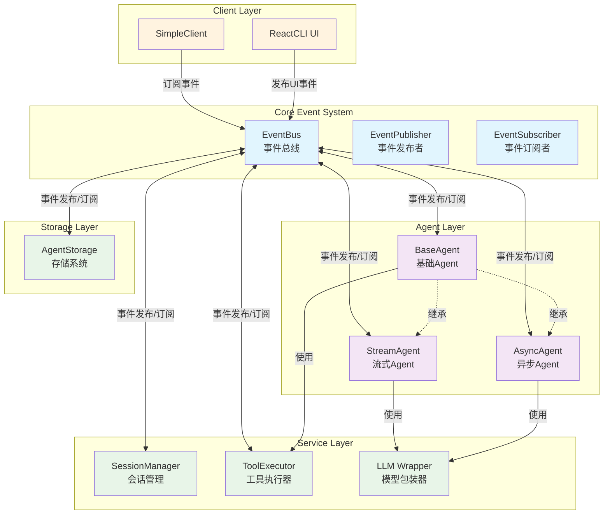
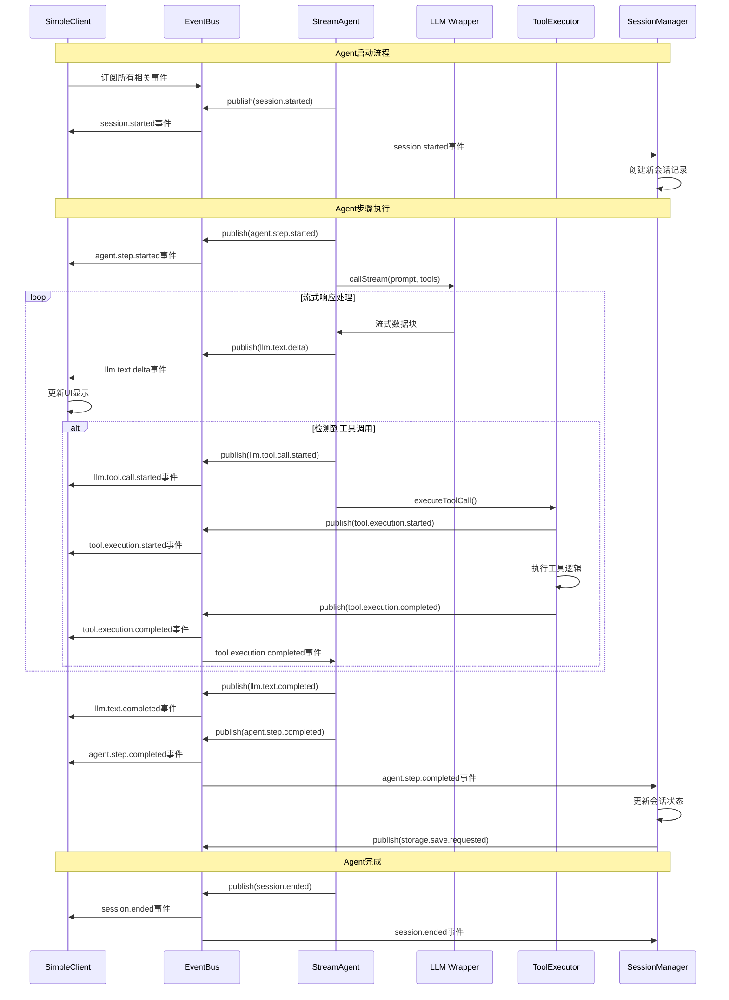
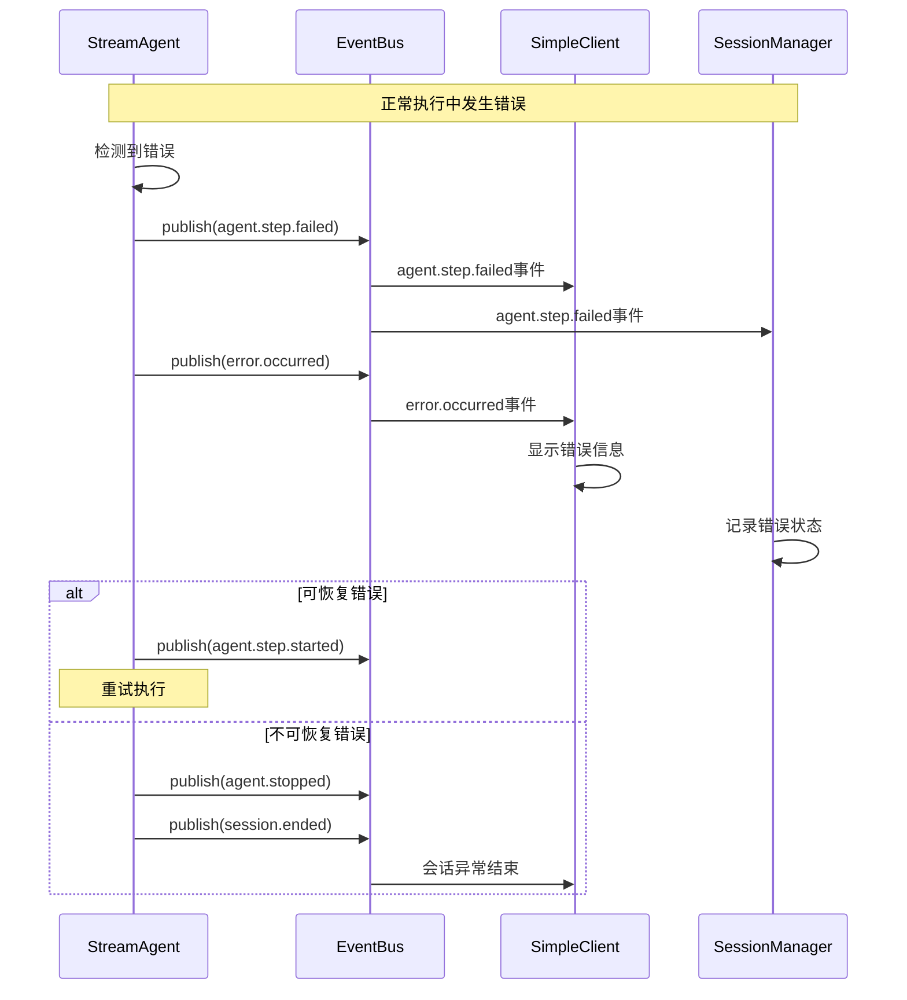
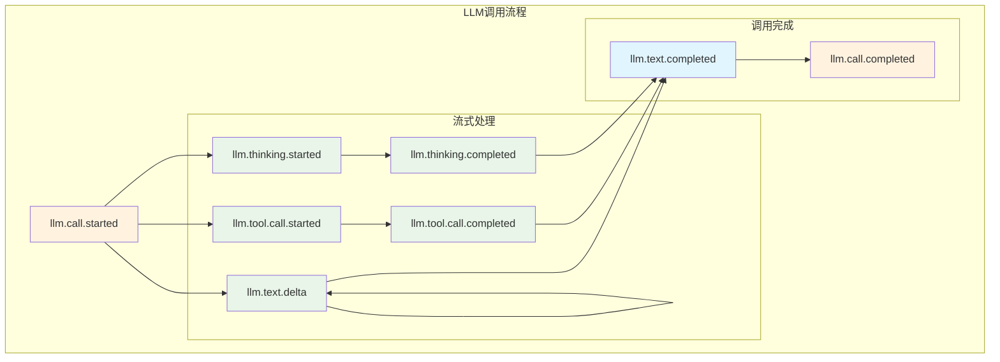
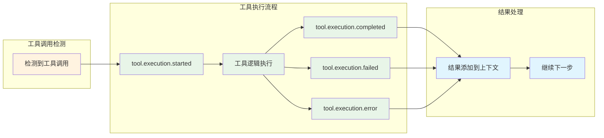
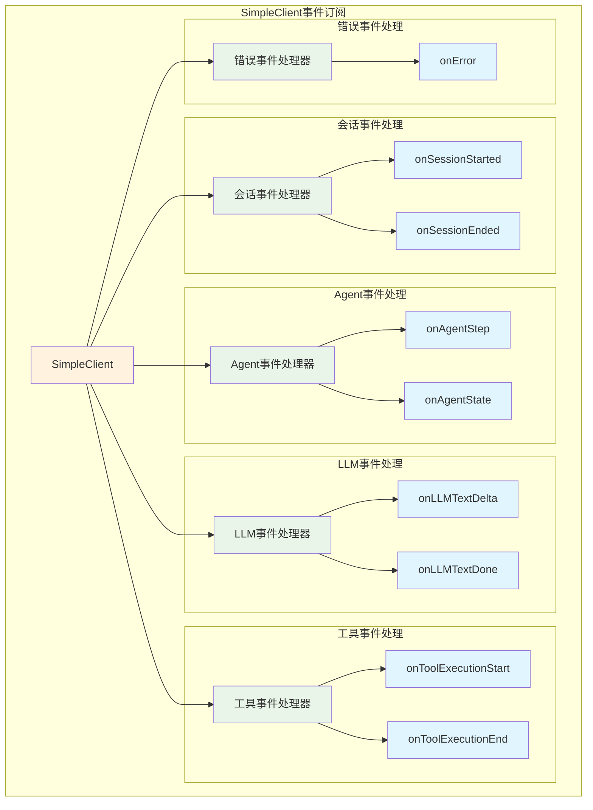

# 事件流图 (Event Flow Diagrams)

## 概述

本文档展示了Continue-Reasoning事件驱动架构中的各种事件流模式，通过可视化图表和代码示例帮助理解系统的事件处理机制。

## 1. 系统整体事件流架构



## 2. Agent执行生命周期事件流

### 2.1 完整的Agent执行流程



### 2.2 错误处理事件流



## 3. 事件类型分组流图

### 3.1 会话管理事件流

```mermaid
graph LR
    subgraph "会话生命周期"
        SessionStart[session.started]
        SessionEnd[session.ended] 
        SessionSwitch[session.switched]
    end
    
    subgraph "Agent状态事件"
        AgentSetupStart[agent.setup.started]
        AgentSetupDone[agent.setup.completed]
        AgentStateChange[agent.state.changed]
        AgentStop[agent.stopped]
    end
    
    subgraph "步骤执行事件"
        StepStart[agent.step.started]
        StepDone[agent.step.completed]
        StepFail[agent.step.failed]
    end
    
    SessionStart --> AgentSetupStart
    AgentSetupStart --> AgentSetupDone
    AgentSetupDone --> StepStart
    StepStart --> StepDone
    StepDone --> StepStart
    StepFail --> StepStart
    StepDone --> SessionEnd
    AgentStop --> SessionEnd
    
    classDef session fill:#e3f2fd
    classDef agent fill:#f3e5f5
    classDef step fill:#e8f5e8
    
    class SessionStart,SessionEnd,SessionSwitch session
    class AgentSetupStart,AgentSetupDone,AgentStateChange,AgentStop agent  
    class StepStart,StepDone,StepFail step
```

### 3.2 LLM处理事件流



### 3.3 工具执行事件流



## 4. 客户端事件订阅模式

### 4.1 SimpleClient事件订阅架构



### 4.2 事件过滤和路由示例

```typescript
// 1. 基础事件订阅（所有事件）
this.eventBus.subscribe('agent.step.completed', (event) => {
    console.log('任何Agent的步骤完成');
});

// 2. 会话过滤（只处理当前会话）
this.eventBus.subscribe('agent.step.completed', (event) => {
    console.log('当前会话的步骤完成');
}, {
    sessionId: this.currentSessionId
});

// 3. 来源过滤（只处理特定Agent）
this.eventBus.subscribe('agent.step.completed', (event) => {
    console.log('特定Agent的步骤完成');
}, {
    source: 'agent.my-coding-agent'
});

// 4. 步骤过滤（只处理特定步骤）
this.eventBus.subscribe('tool.execution.started', (event) => {
    console.log('第5步的工具执行');
}, {
    stepIndex: 5
});

// 5. 组合过滤（多条件）
this.eventBus.subscribe('llm.text.delta', (event) => {
    console.log('特定会话、特定Agent的文本增量');
}, {
    sessionId: this.currentSessionId,
    source: 'agent.stream-agent',
    stepIndex: 3
});
```

## 5. 实际代码示例

### 5.1 StreamAgent中的事件发布

```typescript
export class StreamAgent extends BaseAgent {
    async processStreamResponse(prompt: string, toolDefs: any[], stepIndex: number) {
        // 1. 发布LLM调用开始事件
        await this.eventBus.publish({
            type: 'llm.call.started',
            timestamp: Date.now(),
            source: `agent.${this.id}`,
            stepIndex,
            sessionId: this.currentSessionId,
            data: {
                callType: 'stream',
                isStreaming: true
            }
        });

        // 2. 处理流式响应
        await this.llm.callStream(prompt, toolDefs, async (chunk) => {
            if (chunk.content) {
                // 发布文本增量事件
                await this.eventBus.publish({
                    type: 'llm.text.delta',
                    timestamp: Date.now(),
                    source: `agent.${this.id}`,
                    stepIndex,
                    sessionId: this.currentSessionId,
                    data: {
                        content: chunk.content,
                        delta: chunk.content,
                        chunkIndex: chunk.chunkIndex || 0,
                        stepIndex
                    }
                });
            }

            if (chunk.toolCall) {
                // 发布工具调用开始事件
                await this.eventBus.publish({
                    type: 'llm.tool.call.started',
                    timestamp: Date.now(),
                    source: `agent.${this.id}`,
                    stepIndex,
                    sessionId: this.currentSessionId,
                    data: {
                        toolCall: chunk.toolCall,
                        stepIndex
                    }
                });
                
                // 执行工具调用
                await this.handleToolCallExecution(chunk.toolCall, stepIndex);
            }
        });

        // 3. 发布调用完成事件
        await this.eventBus.publish({
            type: 'llm.call.completed',
            timestamp: Date.now(),
            source: `agent.${this.id}`,
            stepIndex,
            sessionId: this.currentSessionId,
            data: {
                callType: 'stream',
                isStreaming: true
            }
        });
    }
}
```

### 5.2 SimpleClient中的事件订阅

```typescript
export class SimpleClient implements IClient {
    private setupEventListeners(): void {
        if (!this.eventBus) return;
        
        // 会话事件 - 带类型守卫
        this.eventBus.subscribe('session.started', (event) => {
            if (event.type === 'session.started') {
                console.log(`🎬 会话开始: ${event.sessionId}`);
                this.onSessionStarted(event.sessionId);
            }
        });
        
        // Agent步骤事件 - 带数据验证
        this.eventBus.subscribe('agent.step.completed', (event) => {
            if (event.type === 'agent.step.completed' && event.data?.step) {
                console.log(`✅ 步骤 ${event.stepIndex} 完成`);
                this.onAgentStep(event.data.step);
            }
        });
        
        // LLM文本增量 - 实时更新UI
        this.eventBus.subscribe('llm.text.delta', (event) => {
            if (event.type === 'llm.text.delta' && 
                event.data?.stepIndex !== undefined && 
                event.data?.chunkIndex !== undefined && 
                event.data?.delta) {
                
                // 实时更新UI显示
                this.onLLMTextDelta(
                    event.data.stepIndex, 
                    event.data.chunkIndex, 
                    event.data.delta
                );
            }
        });
        
        // 工具执行事件 - 显示进度
        this.eventBus.subscribe('tool.execution.started', (event) => {
            if (event.type === 'tool.execution.started' && event.data?.toolCall) {
                console.log(`🔧 开始执行工具: ${event.data.toolCall.name}`);
                this.onToolExecutionStart(event.data.toolCall);
            }
        });
        
        this.eventBus.subscribe('tool.execution.completed', (event) => {
            if (event.type === 'tool.execution.completed' && event.data?.result) {
                console.log(`✅ 工具执行完成`);
                this.onToolExecutionEnd(event.data.result);
            }
        });
        
        // 错误事件 - 统一错误处理
        this.eventBus.subscribe('error.occurred', (event) => {
            if (event.type === 'error.occurred' && event.data?.error) {
                console.error(`❌ 系统错误:`, event.data.error);
                this.onError(event.data.error);
            }
        });
    }
}
```

## 6. 事件调试和监控

### 6.1 事件历史查询

```typescript
// 获取最近的所有事件
const allRecentEvents = this.eventBus.getEventHistory();

// 获取特定类型的事件
const textEvents = this.eventBus.getEventHistory({
    type: 'llm.text.delta'
});

// 获取特定会话的事件
const sessionEvents = this.eventBus.getEventHistory({
    sessionId: 'session-123'
});

// 获取特定时间范围的事件
const recentEvents = this.eventBus.getEventHistory({
    timestamp: { after: Date.now() - 60000 } // 最近1分钟
});
```

### 6.2 性能监控

```typescript
// 获取事件统计信息
const stats = this.eventBus.getStats();
console.log('事件系统统计:', {
    totalEvents: stats.totalEvents,
    activeSubscriptions: stats.activeSubscriptions,
    eventsByType: stats.eventsByType
});

// 监控高频事件
if (stats.eventsByType['llm.text.delta'] > 1000) {
    console.warn('LLM文本增量事件频率过高，考虑批处理优化');
}
```

## 7. 事件流最佳实践

### 7.1 事件命名一致性

```typescript
// ✅ 好的命名 - 遵循 类别.对象.动作 格式
'session.started'           // 会话已开始
'agent.step.completed'      // Agent步骤已完成  
'llm.text.delta'           // LLM文本增量
'tool.execution.failed'     // 工具执行已失败

// ❌ 避免的命名
'sessionStart'             // 缺少类别前缀
'agent.stepComplete'       // 不规范的动作形式
'llm.text.chunk'          // 不清晰的意图
'tool.fail'               // 缺少上下文
```

### 7.2 类型安全的事件处理

```typescript
// ✅ 推荐 - 使用类型守卫
this.eventBus.subscribe('agent.step.completed', (event) => {
    if (event.type === 'agent.step.completed' && event.data?.step) {
        this.handleAgentStep(event.data.step);
    }
});

// ❌ 避免 - 直接访问可能undefined的属性
this.eventBus.subscribe('agent.step.completed', (event) => {
    this.handleAgentStep(event.data.step); // 可能runtime错误
});
```

### 7.3 资源管理

```typescript
export class MyComponent extends EventSubscriber {
    constructor(eventBus: IEventBus) {
        super(eventBus, 'MyComponent');
        
        // 订阅事件
        this.subscribeToEvent('agent.step.completed', this.handleStep.bind(this));
        this.subscribeToEvent('error.occurred', this.handleError.bind(this));
    }
    
    dispose() {
        // 自动清理所有订阅，防止内存泄漏
        this.cleanup();
    }
}
```

## 总结

事件流图展示了Continue-Reasoning事件驱动架构的：

1. **清晰的事件流向** - 从发布到订阅的完整路径
2. **组件间的松耦合关系** - 通过事件总线实现解耦
3. **类型安全的事件处理** - TypeScript类型系统保障
4. **灵活的事件过滤机制** - 支持多维度事件筛选
5. **完整的生命周期管理** - 从订阅到清理的全流程

通过这些事件流模式，系统实现了高效、可靠、可扩展的事件驱动通信机制。 