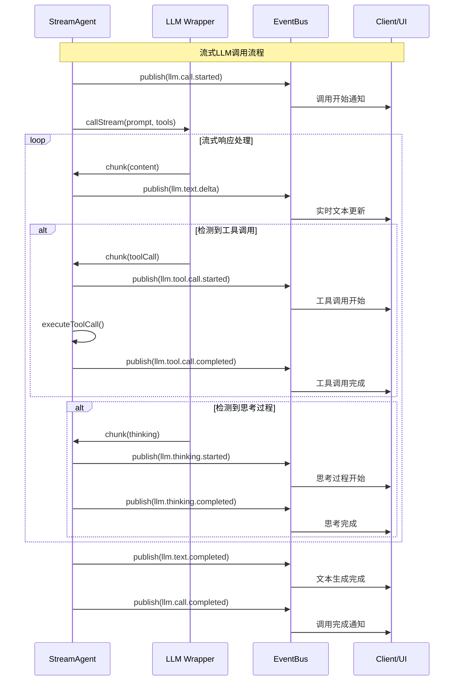
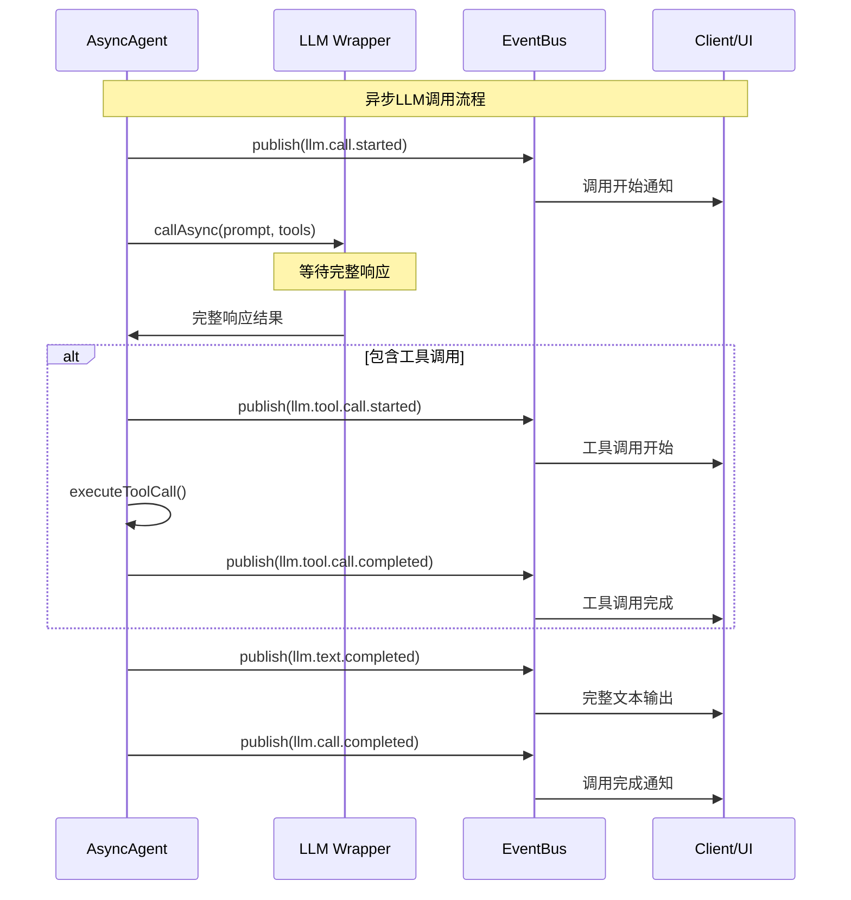

# LLM事件处理机制 (LLM Event Handling)

## 概述

LLM事件处理是Continue-Reasoning事件驱动架构的核心部分，负责处理大语言模型的调用、流式响应、工具调用和思考过程。通过事件机制，系统实现了对LLM交互过程的完整追踪和实时反馈。

## LLM事件类型体系

### 基础LLM事件接口

```typescript
export interface LLMEvent extends BaseEvent {
    type: 
        | 'llm.call.started'           // LLM调用开始
        | 'llm.call.completed'         // LLM调用完成
        | 'llm.text.delta'             // 文本增量输出（流式）
        | 'llm.text.completed'         // 文本生成完成
        | 'llm.tool.call.started'      // 工具调用开始
        | 'llm.tool.call.completed'    // 工具调用完成
        | 'llm.thinking.started'       // 思考开始
        | 'llm.thinking.completed';    // 思考完成
        
    stepIndex?: number;
    data: {
        // 基础内容
        content?: string;              // 文本内容
        chunkIndex?: number;           // 块索引
        outputIndex?: number;          // 输出索引
        
        // 工具调用相关
        toolCall?: ToolCallParams;     // 工具调用参数
        result?: any;                  // 调用结果
        error?: Error;                 // 错误信息
        
        // 思考相关
        thought?: string;              // 思考内容
        confidence?: number;           // 置信度
        finalThought?: string;         // 最终思考
        
        // 调用模式标识
        isStreaming?: boolean;         // 是否为流式调用
        callType?: 'async' | 'stream'; // 调用类型
        
        // 客户端兼容属性
        stepIndex?: number;            // 步骤索引
        delta?: string;                // 文本增量
        text?: string;                 // 完整文本
    };
}
```

## LLM事件流处理模式

### 1. 流式调用事件流 (StreamAgent)



### 2. 异步调用事件流 (AsyncAgent)



## LLM事件映射器 (LLMEventMapper)

### 核心功能

LLMEventMapper负责将原始的LLM响应数据转换为标准化的事件格式：

```typescript
export class LLMEventMapper {
    /**
     * 将流式数据块转换为事件
     */
    static convertChunkToEvents(
        chunk: any,
        stepIndex: number,
        sessionId?: string,
        source: string = 'Agent'
    ): LLMEvent[] {
        const events: LLMEvent[] = [];
        
        // 1. 处理文本内容
        if (chunk.content) {
            events.push({
                type: 'llm.text.delta',
                timestamp: Date.now(),
                source,
                stepIndex,
                sessionId,
                data: {
                    content: chunk.content,
                    delta: chunk.content,
                    chunkIndex: chunk.chunkIndex || 0,
                    stepIndex,
                    isStreaming: true,
                    callType: 'stream'
                }
            });
        }
        
        // 2. 处理工具调用
        if (chunk.toolCall) {
            events.push({
                type: 'llm.tool.call.started',
                timestamp: Date.now(),
                source,
                stepIndex,
                sessionId,
                data: {
                    toolCall: chunk.toolCall,
                    stepIndex,
                    isStreaming: true
                }
            });
        }
        
        // 3. 处理思考过程
        if (chunk.thinking) {
            events.push({
                type: 'llm.thinking.started',
                timestamp: Date.now(),
                source,
                stepIndex,
                sessionId,
                data: {
                    thought: chunk.thinking,
                    stepIndex,
                    confidence: chunk.confidence
                }
            });
        }
        
        return events;
    }
    
    /**
     * 创建流式调用事件生成器
     */
    static createStreamCallEvents(
        stepIndex: number,
        sessionId?: string,
        source: string = 'Agent'
    ) {
        return {
            started: () => ({
                type: 'llm.call.started' as const,
                timestamp: Date.now(),
                source,
                stepIndex,
                sessionId,
                data: {
                    callType: 'stream' as const,
                    isStreaming: true,
                    stepIndex
                }
            }),
            
            completed: () => ({
                type: 'llm.call.completed' as const,
                timestamp: Date.now(),
                source,
                stepIndex,
                sessionId,
                data: {
                    callType: 'stream' as const,
                    isStreaming: true,
                    stepIndex
                }
            }),
            
            textCompleted: (fullText: string) => ({
                type: 'llm.text.completed' as const,
                timestamp: Date.now(),
                source,
                stepIndex,
                sessionId,
                data: {
                    content: fullText,
                    text: fullText,
                    stepIndex,
                    isStreaming: true
                }
            })
        };
    }
}
```

## 具体实现示例

### 1. StreamAgent中的LLM事件处理

```typescript
export class StreamAgent extends BaseAgent {
    private async processStreamResponse(
        prompt: string,
        toolDefs: any[],
        stepIndex: number
    ): Promise<void> {
        // 创建事件生成器
        const llmEvents = LLMEventMapper.createStreamCallEvents(
            stepIndex,
            this.currentSessionId,
            `agent.${this.id}`
        );

        // 发布调用开始事件
        await this.eventBus.publish(llmEvents.started());

        try {
            // 初始化步骤数据容器
            this.currentStepData = {
                stepIndex,
                rawText: '',
                toolCalls: [],
                toolExecutionResults: [],
                toolExecutionPromises: [],
                isComplete: false
            };

            // 执行流式调用
            await this.llm.callStream(prompt, toolDefs, async (chunk: any) => {
                await this.handleStreamChunk(chunk, stepIndex, 
                    this.currentStepData?.chunkCount || 0, llmEvents);
                
                if (this.currentStepData) {
                    this.currentStepData.chunkCount = (this.currentStepData.chunkCount || 0) + 1;
                }
            });

            // 等待工具执行完成
            if (this.currentStepData?.toolExecutionPromises.length > 0) {
                await Promise.all(this.currentStepData.toolExecutionPromises);
            }

            // 发布文本完成事件
            await this.eventBus.publish(llmEvents.textCompleted(
                this.currentStepData?.rawText || ''
            ));

            // 发布调用完成事件
            await this.eventBus.publish(llmEvents.completed());

            // 标记步骤完成
            if (this.currentStepData) {
                this.currentStepData.isComplete = true;
            }

        } catch (error) {
            // 发布错误事件
            await this.eventBus.publish({
                type: 'error.occurred',
                timestamp: Date.now(),
                source: `agent.${this.id}`,
                stepIndex,
                sessionId: this.currentSessionId,
                data: {
                    error: error instanceof Error ? error : new Error(String(error)),
                    context: { stepIndex, prompt: prompt.substring(0, 100) }
                }
            });
            throw error;
        }
    }

    private async handleStreamChunk(
        chunk: any,
        stepIndex: number,
        chunkIndex: number,
        llmEvents: any
    ): Promise<void> {
        logger.debug(`[StreamAgent] 处理流式数据块 ${chunkIndex}`, chunk);

        // 转换为标准事件
        const events = LLMEventMapper.convertChunkToEvents(
            chunk, 
            stepIndex, 
            this.currentSessionId, 
            `agent.${this.id}`
        );

        // 发布所有事件
        for (const event of events) {
            await this.eventBus.publish(event);
        }

        // 更新步骤数据
        if (this.currentStepData) {
            if (chunk.content) {
                this.currentStepData.rawText += chunk.content;
            }

            if (chunk.toolCall) {
                this.currentStepData.toolCalls = this.currentStepData.toolCalls || [];
                this.currentStepData.toolCalls.push(chunk.toolCall);
                
                // 异步执行工具调用
                const toolPromise = this.handleToolCallExecution(chunk.toolCall, stepIndex);
                this.currentStepData.toolExecutionPromises.push(toolPromise);
            }
        }
    }
}
```

### 2. AsyncAgent中的LLM事件处理

```typescript
export class AsyncAgent extends BaseAgent {
    private async processAsyncResponse(
        prompt: string,
        toolDefs: any[],
        stepIndex: number
    ): Promise<void> {
        // 发布调用开始事件
        await this.eventBus.publish({
            type: 'llm.call.started',
            timestamp: Date.now(),
            source: `agent.${this.id}`,
            stepIndex,
            sessionId: this.currentSessionId,
            data: {
                callType: 'async',
                isStreaming: false,
                stepIndex
            }
        });

        try {
            // 执行异步调用
            const response = await this.llm.callAsync(prompt, toolDefs);
            
            // 初始化步骤数据
            this.currentStepData = {
                stepIndex,
                rawText: response.content || '',
                toolCalls: [],
                toolExecutionResults: [],
                toolExecutionPromises: [],
                isComplete: false
            };

            // 处理工具调用（如果有）
            if (response.toolCalls && response.toolCalls.length > 0) {
                this.currentStepData.toolCalls = response.toolCalls;
                
                for (const toolCall of response.toolCalls) {
                    // 发布工具调用开始事件
                    await this.eventBus.publish({
                        type: 'llm.tool.call.started',
                        timestamp: Date.now(),
                        source: `agent.${this.id}`,
                        stepIndex,
                        sessionId: this.currentSessionId,
                        data: {
                            toolCall,
                            stepIndex
                        }
                    });
                    
                    // 执行工具调用
                    const toolPromise = this.handleToolCallExecution(toolCall, stepIndex);
                    this.currentStepData.toolExecutionPromises.push(toolPromise);
                }
                
                // 等待所有工具执行完成
                await Promise.all(this.currentStepData.toolExecutionPromises);
            }

            // 发布文本完成事件
            await this.eventBus.publish({
                type: 'llm.text.completed',
                timestamp: Date.now(),
                source: `agent.${this.id}`,
                stepIndex,
                sessionId: this.currentSessionId,
                data: {
                    content: this.currentStepData.rawText,
                    text: this.currentStepData.rawText,
                    stepIndex,
                    isStreaming: false
                }
            });

            // 发布调用完成事件
            await this.eventBus.publish({
                type: 'llm.call.completed',
                timestamp: Date.now(),
                source: `agent.${this.id}`,
                stepIndex,
                sessionId: this.currentSessionId,
                data: {
                    callType: 'async',
                    isStreaming: false,
                    stepIndex
                }
            });

            // 标记完成
            this.currentStepData.isComplete = true;

        } catch (error) {
            // 发布错误事件
            await this.eventBus.publish({
                type: 'error.occurred',
                timestamp: Date.now(),
                source: `agent.${this.id}`,
                stepIndex,
                sessionId: this.currentSessionId,
                data: {
                    error: error instanceof Error ? error : new Error(String(error)),
                    context: { stepIndex, callType: 'async' }
                }
            });
            throw error;
        }
    }
}
```

## 客户端LLM事件处理

### SimpleClient中的LLM事件订阅

```typescript
export class SimpleClient implements IClient {
    private setupLLMEventListeners(): void {
        if (!this.eventBus) return;

        // 1. LLM调用开始 - 显示加载状态
        this.eventBus.subscribe('llm.call.started', (event) => {
            if (event.type === 'llm.call.started') {
                console.log(`🤖 LLM调用开始 (步骤 ${event.stepIndex})`);
                this.showLoadingState(event.stepIndex || 0);
            }
        });

        // 2. 文本增量 - 实时更新UI
        this.eventBus.subscribe('llm.text.delta', (event) => {
            if (event.type === 'llm.text.delta' && 
                event.data?.stepIndex !== undefined && 
                event.data?.chunkIndex !== undefined && 
                event.data?.delta) {
                
                this.onLLMTextDelta(
                    event.data.stepIndex, 
                    event.data.chunkIndex, 
                    event.data.delta
                );
            }
        });

        // 3. 工具调用开始 - 显示工具执行状态
        this.eventBus.subscribe('llm.tool.call.started', (event) => {
            if (event.type === 'llm.tool.call.started' && event.data?.toolCall) {
                console.log(`🔧 检测到工具调用: ${event.data.toolCall.name}`);
                this.showToolCallStarted(event.data.toolCall);
            }
        });

        // 4. 工具调用完成 - 更新工具状态
        this.eventBus.subscribe('llm.tool.call.completed', (event) => {
            if (event.type === 'llm.tool.call.completed') {
                console.log(`✅ 工具调用完成`);
                this.showToolCallCompleted();
            }
        });

        // 5. 思考过程 - 显示AI思考状态
        this.eventBus.subscribe('llm.thinking.started', (event) => {
            if (event.type === 'llm.thinking.started' && event.data?.thought) {
                console.log(`💭 AI思考: ${event.data.thought}`);
                this.showThinkingProcess(event.data.thought, event.data?.confidence);
            }
        });

        // 6. 文本完成 - 完整输出
        this.eventBus.subscribe('llm.text.completed', (event) => {
            if (event.type === 'llm.text.completed' && event.data?.text) {
                this.onLLMTextDone(
                    event.data.stepIndex || 0, 
                    0, 
                    event.data.text
                );
            }
        });

        // 7. 调用完成 - 隐藏加载状态
        this.eventBus.subscribe('llm.call.completed', (event) => {
            if (event.type === 'llm.call.completed') {
                console.log(`✅ LLM调用完成 (步骤 ${event.stepIndex})`);
                this.hideLoadingState(event.stepIndex || 0);
            }
        });
    }

    private showLoadingState(stepIndex: number): void {
        // 显示加载动画或进度指示器
        console.log(`🔄 步骤 ${stepIndex} - LLM处理中...`);
    }

    private hideLoadingState(stepIndex: number): void {
        // 隐藏加载状态
        console.log(`✅ 步骤 ${stepIndex} - LLM处理完成`);
    }

    private showToolCallStarted(toolCall: any): void {
        // 显示工具执行状态
        console.log(`🔧 执行工具: ${toolCall.name}`);
    }

    private showToolCallCompleted(): void {
        // 工具执行完成反馈
        console.log(`✅ 工具执行完成`);
    }

    private showThinkingProcess(thought: string, confidence?: number): void {
        // 显示思考过程
        const confidenceText = confidence ? ` (置信度: ${confidence})` : '';
        console.log(`💭 思考${confidenceText}: ${thought}`);
    }
}
```

## LLM事件性能优化

### 1. 文本增量事件批处理

对于高频的文本增量事件，可以实现批处理优化：

```typescript
class LLMTextDeltaBatcher {
    private pendingDeltas: Array<{
        stepIndex: number;
        chunkIndex: number;
        content: string;
        timestamp: number;
    }> = [];
    
    private batchTimer?: NodeJS.Timeout;
    private readonly batchWindowMs = 50; // 50ms批处理窗口
    
    constructor(private eventBus: IEventBus, private source: string) {}
    
    addTextDelta(stepIndex: number, chunkIndex: number, content: string): void {
        this.pendingDeltas.push({
            stepIndex,
            chunkIndex,
            content,
            timestamp: Date.now()
        });
        
        if (!this.batchTimer) {
            this.batchTimer = setTimeout(() => {
                this.flushBatch();
            }, this.batchWindowMs);
        }
    }
    
    private flushBatch(): void {
        if (this.pendingDeltas.length === 0) return;
        
        // 合并连续的文本增量
        const mergedContent = this.pendingDeltas
            .map(delta => delta.content)
            .join('');
        
        const firstDelta = this.pendingDeltas[0];
        const lastDelta = this.pendingDeltas[this.pendingDeltas.length - 1];
        
        // 发布合并后的事件
        this.eventBus.publish({
            type: 'llm.text.delta',
            timestamp: lastDelta.timestamp,
            source: this.source,
            stepIndex: firstDelta.stepIndex,
            data: {
                content: mergedContent,
                delta: mergedContent,
                chunkIndex: firstDelta.chunkIndex,
                stepIndex: firstDelta.stepIndex,
                batchSize: this.pendingDeltas.length
            }
        });
        
        // 清理
        this.pendingDeltas = [];
        this.batchTimer = undefined;
    }
}
```

### 2. 事件过滤优化

```typescript
// 只订阅当前活跃步骤的事件
const currentStepFilter = { stepIndex: this.currentStepIndex };

this.eventBus.subscribe('llm.text.delta', this.handleTextDelta, currentStepFilter);
this.eventBus.subscribe('llm.tool.call.started', this.handleToolCall, currentStepFilter);

// 只订阅特定会话的事件
const sessionFilter = { sessionId: this.currentSessionId };

this.eventBus.subscribe([
    'llm.call.started',
    'llm.call.completed'
], this.handleLLMLifecycle, sessionFilter);
```

## 错误处理和恢复

### LLM调用错误处理

```typescript
export class LLMErrorHandler {
    constructor(private eventBus: IEventBus) {
        this.setupErrorSubscriptions();
    }
    
    private setupErrorSubscriptions(): void {
        // 监听所有LLM相关错误
        this.eventBus.subscribe('error.occurred', async (event) => {
            if (event.source?.includes('agent') && event.data?.context?.stepIndex !== undefined) {
                await this.handleLLMError(event);
            }
        });
    }
    
    private async handleLLMError(event: ErrorEvent): Promise<void> {
        const error = event.data.error;
        const context = event.data.context;
        
        console.error(`❌ LLM错误 (步骤 ${context.stepIndex}):`, error);
        
        // 根据错误类型决定恢复策略
        if (this.isRetryableError(error)) {
            // 发布重试事件
            await this.eventBus.publish({
                type: 'llm.call.retry',
                timestamp: Date.now(),
                source: 'ErrorHandler',
                stepIndex: context.stepIndex,
                data: {
                    originalError: error,
                    retryCount: context.retryCount || 0
                }
            });
        } else {
            // 发布不可恢复错误事件
            await this.eventBus.publish({
                type: 'llm.call.failed',
                timestamp: Date.now(),
                source: 'ErrorHandler',
                stepIndex: context.stepIndex,
                data: {
                    error,
                    fatal: true
                }
            });
        }
    }
    
    private isRetryableError(error: any): boolean {
        const errorStr = String(error);
        return errorStr.includes('rate limit') || 
               errorStr.includes('timeout') || 
               errorStr.includes('network');
    }
}
```

## 调试和监控

### LLM事件监控面板

```typescript
class LLMEventMonitor {
    private stats = {
        totalCalls: 0,
        streamingCalls: 0,
        asyncCalls: 0,
        toolCalls: 0,
        errors: 0,
        averageResponseTime: 0
    };
    
    constructor(private eventBus: IEventBus) {
        this.setupMonitoring();
    }
    
    private setupMonitoring(): void {
        // 监控LLM调用开始
        this.eventBus.subscribe('llm.call.started', (event) => {
            this.stats.totalCalls++;
            if (event.data?.callType === 'stream') {
                this.stats.streamingCalls++;
            } else {
                this.stats.asyncCalls++;
            }
        });
        
        // 监控工具调用
        this.eventBus.subscribe('llm.tool.call.started', () => {
            this.stats.toolCalls++;
        });
        
        // 监控错误
        this.eventBus.subscribe('error.occurred', (event) => {
            if (event.source?.includes('agent')) {
                this.stats.errors++;
            }
        });
        
        // 定期输出统计信息
        setInterval(() => {
            this.printStats();
        }, 30000); // 每30秒
    }
    
    private printStats(): void {
        console.log('📊 LLM事件统计:', {
            totalCalls: this.stats.totalCalls,
            streamingCalls: this.stats.streamingCalls,
            asyncCalls: this.stats.asyncCalls,
            toolCalls: this.stats.toolCalls,
            errors: this.stats.errors,
            errorRate: `${((this.stats.errors / this.stats.totalCalls) * 100).toFixed(2)}%`
        });
    }
}
```

## 最佳实践总结

### 1. 事件发布原则

- **及时发布**: 在LLM交互的关键节点立即发布事件
- **数据完整**: 确保事件数据包含足够的上下文信息
- **错误处理**: 所有异常都应转换为错误事件

### 2. 事件订阅原则

- **类型安全**: 使用类型守卫验证事件数据
- **过滤优化**: 使用事件过滤减少不必要的处理
- **资源管理**: 及时清理事件订阅，避免内存泄漏

### 3. 性能优化原则

- **批处理**: 对高频事件进行批处理
- **选择订阅**: 只订阅必要的事件类型
- **状态管理**: 合理管理事件处理状态

### 4. 调试和监控原则

- **事件历史**: 保留足够的事件历史用于调试
- **统计监控**: 定期收集和分析事件统计
- **错误追踪**: 完整记录错误上下文和恢复过程

通过完善的LLM事件处理机制，Continue-Reasoning实现了对大语言模型交互过程的全面管控和优化，提供了良好的用户体验和系统可观测性。 