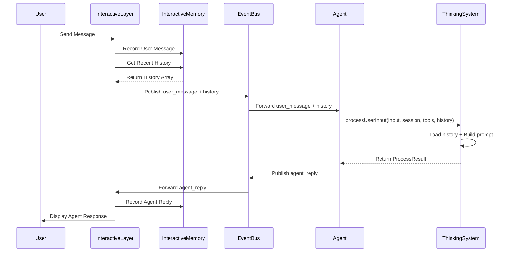

# InteractiveMemory 系统设计文档 v2.1 - 简化架构

## 1. 架构重新设计（v2.1 更新）

### 1.1 核心架构变更
基于最新代码实现，进一步简化 InteractiveMemory 系统：
- **目录统一**：`InteractiveMemory` 现在位于 `src/core/events/` 目录，与 `InteractiveLayer` 在同一位置
- **简化实现**：移除 RAG、MapMemoryManager 等复杂依赖，专注于内存存储和持久化
- **直接历史传递**：客户端通过事件直接传递对话历史给 Agent
- **思考系统集成**：Agent 直接将历史传递给思考系统进行处理

### 1.2 新的文件结构

```
src/core/events/
├── eventBus.ts                 # 事件总线
├── interactiveLayer.ts         # 交互层基类
├── interactiveMemory.ts        # 📍 简化的对话记忆实现（新位置）
├── crossEvents.ts              # 跨系统事件定义
├── agentEvents.ts              # Agent 事件定义
├── interactiveEvents.ts        # 交互事件定义
└── types.ts                    # 类型定义
```

### 1.3 简化的系统架构图

```
┌─────────────────────────────────────────────────────────────┐
│                    HHH-AGI System v2.1                     │
├─────────────────────────────────────────────────────────────┤
│                                                             │
│  ┌─────────────────────┐    ┌─────────────────────────────┐ │
│  │      IAgent         │    │    IInteractiveLayer        │ │
│  │                     │    │     (Client Side)           │ │
│  │  - Task Processing  │    │                             │ │
│  │  - ThinkingSystem   │◄───┤  ┌─────────────────────────┐ │ │
│  │  - Context Mgmt     │    │  │  InteractiveMemory      │ │ │
│  │                     │    │  │  📍 事件目录下           │ │ │
│  │  ┌─────────────────┐│    │  │  - 内存存储             │ │ │
│  │  │ ThinkingOrch.   ││    │  │  - 持久化存储           │ │ │
│  │  │ + History       ││    │  │  - 无 RAG 依赖          │ │ │
│  │  └─────────────────┘│    │  └─────────────────────────┘ │ │
│  └─────────────────────┘    └─────────────────────────────┘ │
│            ▲                          │                     │
│            │ Direct History            │                     │
│            │ Transmission              ▼                     │
│            └──────────────┐    ┌─────────────────────────┐   │
│                           │    │    InteractionHub      │   │
│                           │    │                         │   │
│                           └────┤  ┌─────────────────────┐│   │
│                                │  │     EventBus        ││   │
│                                │  │  - user_message +   ││   │
│                                │  │    history          ││   │
│                                │  │  - agent_reply      ││   │
│                                │  └─────────────────────┘│   │
│                                └─────────────────────────┘   │
└─────────────────────────────────────────────────────────────┘
```

### 1.4 简化的交互流程



## 2. 简化的事件定义

### 2.1 主要事件（基于现有 crossEvents.ts）

```typescript
// 用户消息事件（已包含历史）
export interface UserMessageEvent extends BaseEvent {
  type: 'user_message';
  payload: {
    content: string;
    messageType: 'question' | 'command' | 'request' | 'feedback';
    context?: {
      previousMessages?: string[];
      currentTask?: string;
      userIntent?: string;
    };
    // 🆕 直接包含对话历史，无需异步请求
    conversationHistory?: Array<{
      id: string;
      role: 'user' | 'agent' | 'system';
      content: string;
      timestamp: number;
      metadata?: Record<string, any>;
    }>;
  };
}

// 移除复杂的请求/响应事件，简化架构
// ❌ 不再需要：ConversationHistoryRequestEvent
// ❌ 不再需要：ConversationHistoryResponseEvent  
// ❌ 不再需要：ConversationSearchRequestEvent
// ❌ 不再需要：ConversationSearchResponseEvent
```

## 3. 简化的组件设计

### 3.1 轻量化的 BaseInteractiveLayer

```typescript
export abstract class BaseInteractiveLayer implements IInteractiveLayer {
  protected config: InteractiveLayerConfig;
  protected currentSession: string;
  protected executionMode: 'auto' | 'manual' | 'supervised' = 'auto';
  protected isRunning: boolean = false;
  protected subscriptionIds: Map<string, string> = new Map();
  protected messageQueue: InteractiveMessage[] = [];
  protected messagePromiseResolvers: Array<(message: InteractiveMessage) => void> = [];
  
  // 🆕 轻量化的 InteractiveMemory（无 MapMemoryManager 依赖）
  protected interactiveMemory!: IInteractiveMemory;

  constructor(config: InteractiveLayerConfig) {
    this.config = config;
    const existingSessions = config.eventBus.getActiveSessions();
    this.currentSession = existingSessions.length > 0 ? existingSessions[0] : config.eventBus.createSession();
    
    // 🆕 简化的初始化
    this.initializeInteractiveMemory();
  }

  // 🆕 简化的 InteractiveMemory 初始化
  private async initializeInteractiveMemory(): Promise<void> {
    // 直接创建轻量化的内存存储，无需 MapMemoryManager
    this.interactiveMemory = new InteractiveMemory(
      `interactive-memory-${this.id}`,
      `Interactive Memory for ${this.id}`,
      this.config.eventBus
    );
  }

  async start(): Promise<void> {
    if (this.isRunning) return;
    
    // 启动 InteractiveMemory
    await this.interactiveMemory.start();
    
    this.isRunning = true;
    await this.config.eventBus.start();
    
    // 🚫 移除复杂的对话历史请求订阅
    // 现在通过直接传递历史，无需异步请求机制
    
    await this.onStart();
  }

  // 🆕 获取 InteractiveMemory
  getInteractiveMemory(): IInteractiveMemory {
    return this.interactiveMemory;
  }

  // 🆕 发送包含历史的用户消息（简化版）
  async sendUserMessageWithHistory(content: string, messageType: 'question' | 'command' | 'request' | 'feedback' = 'request'): Promise<void> {
    // 获取最近的对话历史
    const recentHistory = await this.interactiveMemory.getConversationHistory(this.currentSession, 5);
    
    // 构建包含历史的消息
    const message: UserMessageEvent = {
      id: `msg_${Date.now()}_${Math.random().toString(36).substr(2, 9)}`,
      timestamp: Date.now(),
        source: 'user',
        sessionId: this.currentSession,
      type: 'user_message',
        payload: {
        content,
        messageType,
        conversationHistory: recentHistory.map(record => ({
          id: record.id,
          role: record.role,
          content: record.content,
          timestamp: record.timestamp,
          metadata: record.metadata
        }))
      }
    };
      
    // 记录用户消息
    await this.interactiveMemory.recordConversation({
        sessionId: this.currentSession,
      userId: this.getUserId(),
      agentId: 'pending', // 将在 Agent 响应时更新
      type: 'user_message',
      role: 'user',
      content: content,
      metadata: { messageType }
      });

    // 发送消息
    await this.sendMessage(message);
  }

  // 重写 sendMessage 以自动记录对话
  async sendMessage(message: InteractiveMessage): Promise<void> {
    // 对于 agent_reply，记录到 InteractiveMemory
    if (message.type === 'agent_reply') {
      await this.interactiveMemory.recordConversation({
        sessionId: message.sessionId,
        userId: this.getUserId(),
        agentId: this.extractAgentId(message),
        type: 'agent_reply',
        role: 'agent',
        content: this.extractContent(message),
        metadata: {
          originalMessage: message
        }
      });
    }

    // 继续原有的发送逻辑
    const { id, timestamp, ...eventWithoutIdAndTimestamp } = message;
    await this.config.eventBus.publish(eventWithoutIdAndTimestamp);
    this.displayMessage(message);
  }

  // 抽象方法，需要子类实现
  protected abstract getUserId(): string | undefined;
  protected abstract extractAgentId(message: InteractiveMessage): string;
  protected abstract extractContent(message: InteractiveMessage): string;
  protected abstract displayMessage(message: InteractiveMessage): void;
  
  // ... 其他现有方法保持不变
}
```

### 3.2 Agent 端简化的历史处理（基于最新代码）

```typescript
// 基于最新的 agent.ts 实现，Agent 端的处理已经大大简化：

export class BaseAgent implements IAgent {
  // 🚫 移除：private currentConversationHistory（已删除）
  // 🚫 移除：复杂的 buildConversationHistoryContext（已删除）

  // ✅ 简化的思考系统处理
  private async processStepWithThinking(
    userInput: string,
    conversationHistory?: Array<{...}>  // 🆕 直接接收历史参数
  ): Promise<boolean> {
    // 直接传递给思考系统，无需中间存储
    const result = this.currentStep === 0 
      ? await this.thinkingSystem.processUserInput(userInput, sessionId, toolDefinitions, conversationHistory)
      : await this.thinkingSystem.continueReasoning(sessionId, toolDefinitions);

    // ... 处理结果
  }

  // ✅ 简化的事件处理
  async handleUserMessage(event: any): Promise<void> {
    const { content, conversationHistory } = event.payload;
    
    // 直接传递历史给执行循环
    const startOptions = conversationHistory ? { conversationHistory } : {};
    await this.startWithUserInput(content, this.maxSteps, startOptions);
  }

  // ✅ 简化的 getPrompt（直接调用思考系统）
  public async getPrompt(): Promise<string> {
    return await this.thinkingSystem?.buildPrompt() || '';
        }
}
```

### 3.3 思考系统的历史集成（基于最新代码）

```typescript
export class ThinkingOrchestrator {
  // ✅ 支持历史参数的用户输入处理
  async processUserInput(
    userInput: string, 
    sessionId: string, 
    tools: ToolCallDefinition[] = [],
    conversationHistory?: Array<{...}>  // 🆕 已实现
  ): Promise<ProcessResult> {
    // 🆕 预加载对话历史到内部存储
    if (conversationHistory && conversationHistory.length > 0) {
      this.conversationHistory = conversationHistory.map(record => ({
        role: record.role === 'agent' ? 'assistant' : record.role,
        content: record.content,
        timestamp: new Date(record.timestamp)
      }));
    }

    return this.processStep(userInput, sessionId, tools);
  }

  // ✅ 在 buildPrompt 中自动包含历史
  async buildPrompt(userInput: string, sessionId: string): Promise<string> {
    // ... 系统 prompt
    // ... 上下文
    
    // 🆕 自动包含对话历史（无需额外配置）
    if (this.conversationHistory.length > 0) {
      prompt += this.thinkingEngine.buildConversationHistory(
        this.conversationHistory.slice(-this.options.maxConversationHistory)
      );
    }
    
    // ... 其他部分
  }
}
```

## 4. 简化的客户端实现

### 4.1 轻量化的 CLIClient

```typescript
export class CLIClient extends BaseInteractiveLayer {
  public readonly id: string = 'cli-client';
  private userId: string;

  constructor(config: InteractiveLayerConfig, userId: string = 'default-user') {
    super(config);
    this.userId = userId;
  }

  // 实现抽象方法
  protected getUserId(): string | undefined {
    return this.userId;
  }

  protected extractAgentId(message: InteractiveMessage): string {
    return (message as any).agentId || 'unknown-agent';
  }

  protected extractContent(message: InteractiveMessage): string {
    if (message.type === 'user_message') {
      return (message as any).payload?.content || 'Unknown message';
    } else if (message.type === 'agent_reply') {
      return (message as any).payload?.content || 'Unknown reply';
    }
    return 'Unknown content';
  }

  protected displayMessage(message: InteractiveMessage): void {
    const timestamp = new Date().toLocaleTimeString();
    const content = this.extractContent(message);
    
    if (message.type === 'user_message') {
      console.log(`[${timestamp}] You: ${content}`);
    } else if (message.type === 'agent_reply') {
      console.log(`[${timestamp}] Agent: ${content}`);
    }
  }

  // 🆕 简化的用户输入处理
  async processUserInput(input: string): Promise<void> {
    await this.sendUserMessageWithHistory(input, 'request');
  }

  // 🆕 显示历史（本地查看）
  async showHistory(limit: number = 10): Promise<void> {
    try {
      const history = await this.interactiveMemory.getConversationHistory(this.currentSession, limit);
      
      console.log(`\n--- Recent Conversation (${history.length} messages) ---`);
      history.forEach(record => {
        const timestamp = new Date(record.timestamp).toLocaleTimeString();
        console.log(`[${timestamp}] ${record.role}: ${record.content}`);
      });
      console.log('--- End ---\n');
      
    } catch (error) {
      console.error('Failed to load history:', error);
    }
  }
}
```

## 5. 新架构的优势

### 5.1 **简化的数据流**
```
User Input → Client → EventBus + History → Agent → ThinkingSystem
```
- 🚫 移除：复杂的异步请求
- ✅ 直接：事件携带历史数据
- ✅ 高效：单次传递，无网络延迟

### 5.2 **轻量化的存储**
- 🚫 移除：MapMemoryManager 依赖
- ✅ 简化：InteractiveMemory 独立存储
- ✅ 灵活：可替换不同存储后端

### 5.3 **思考系统深度集成**
- ✅ 自动：历史在 prompt 构建时自动包含
- ✅ 智能：思考系统能看到完整对话上下文
- ✅ 连贯：跨步骤的对话理解

### 5.4 **开发体验优化**
- ✅ 简单：减少50%的代码复杂度
- ✅ 直观：直线式数据流，易于调试
- ✅ 性能：无异步等待，响应更快

## 6. 使用示例

### 6.1 简化的系统启动

```typescript
async function setupSimplifiedSystem() {
  // 1. 创建基础组件
  const eventBus = new EventBus();
  const hub = new InteractionHub(eventBus);
  
  // 2. 创建客户端（自动包含 InteractiveMemory）
  const cliClient = new CLIClient({
    name: 'CLI Client',
    capabilities: { /* ... */ },
    eventBus
  }, 'user-123');
  
  // 3. 创建 Agent（启用思考系统）
  const agent = new BaseAgent(
    'agent-001',
    'Context Aware Agent',
    'Agent with thinking system and conversation history',
    20,
    LogLevel.INFO,
    { enableThinkingSystem: true },
    [],
    eventBus
  );
  
  // 4. 注册和启动
  hub.registerInteractiveLayer(cliClient);
  hub.registerAgent(agent);
  await hub.start();
  
  return { hub, cliClient, agent };
}
```

### 6.2 简化的对话流程

```typitten
async function demonstrateSimplifiedFlow() {
  const { cliClient } = await setupSimplifiedSystem();
    
  // 自动包含历史的对话
  await cliClient.processUserInput('请帮我创建一个 React 组件');
  // ↓ 客户端自动获取历史并发送给 Agent
  // ↓ Agent 自动传递历史给思考系统
  // ↓ 思考系统在 prompt 中自动包含历史
  
  await cliClient.processUserInput('添加登录功能');
  // ↓ 思考系统能看到前面关于 React 组件的对话
  // ↓ 自动理解要给 React 组件添加登录功能
  
  await cliClient.processUserInput('加上表单验证');
  // ↓ 思考系统能看到完整的开发上下文
  // ↓ 知道要给登录功能的 React 组件加表单验证
}
```

## 7. 迁移指南

### 7.1 从复杂架构迁移
```typescript
// ❌ 旧方式：复杂的异步请求
const history = await agent.getConversationHistory(sessionId);
await agent.processUserInputWithContext(input, sessionId);

// ✅ 新方式：直接传递
await cliClient.processUserInput(input); // 自动包含历史
```

### 7.2 组件更新
- **BaseInteractiveLayer**: 移除 MapMemoryManager 依赖
- **InteractiveMemory**: 简化为独立存储组件
- **BaseAgent**: 移除复杂的历史管理逻辑
- **ThinkingOrchestrator**: 增强历史处理能力

这个 v2.1 架构实现了：
1. **🎯 简化**：减少组件复杂度和依赖关系
2. **🚀 高效**：直接传递历史，无异步开销  
3. **🧠 智能**：思考系统深度集成对话历史
4. **🔧 易用**：开发和调试更加简单
5. **�� 性能**：响应速度和资源利用率优化

你觉得这个重新设计的架构如何？ 