# Enhanced Snapshot System - Architecture

## 🏗️ System Overview

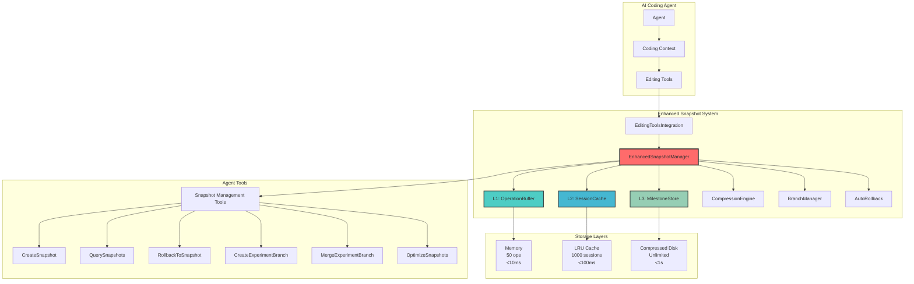

## 📊 Three-Layer Architecture

### Layer 1: Operation Buffer (Hot Storage)
```mermaid
graph LR
    subgraph "L1: OperationBuffer"
        A[Circular Buffer] --> B[50 Operations Max]
        B --> C[<10ms Access]
        C --> D[LRU Eviction]
        
        E[Access Map] --> F[O(1) Lookup]
        
        G[Memory Tracking] --> H[Auto Compression]
        H --> I[Promote to L2]
    end
    
    style A fill:#ff6b6b,stroke:#333,stroke-width:2px
```

### Layer 2: Session Cache (Warm Storage)
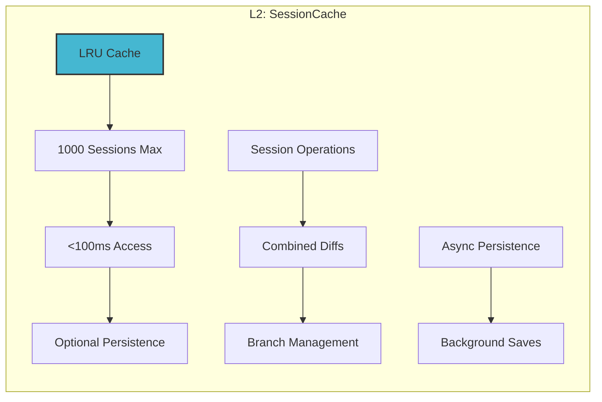

### Layer 3: Milestone Store (Cold Storage)
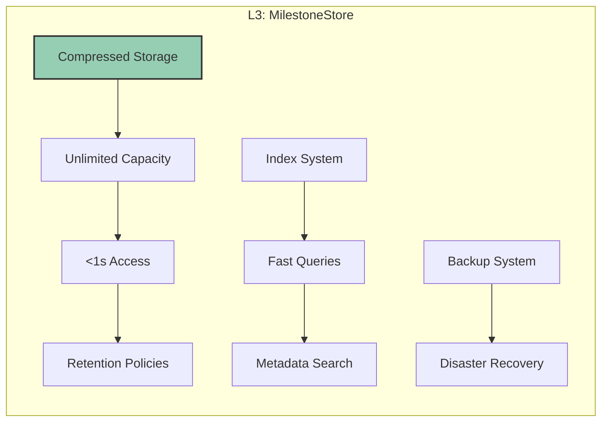

## 🔄 Data Flow Architecture

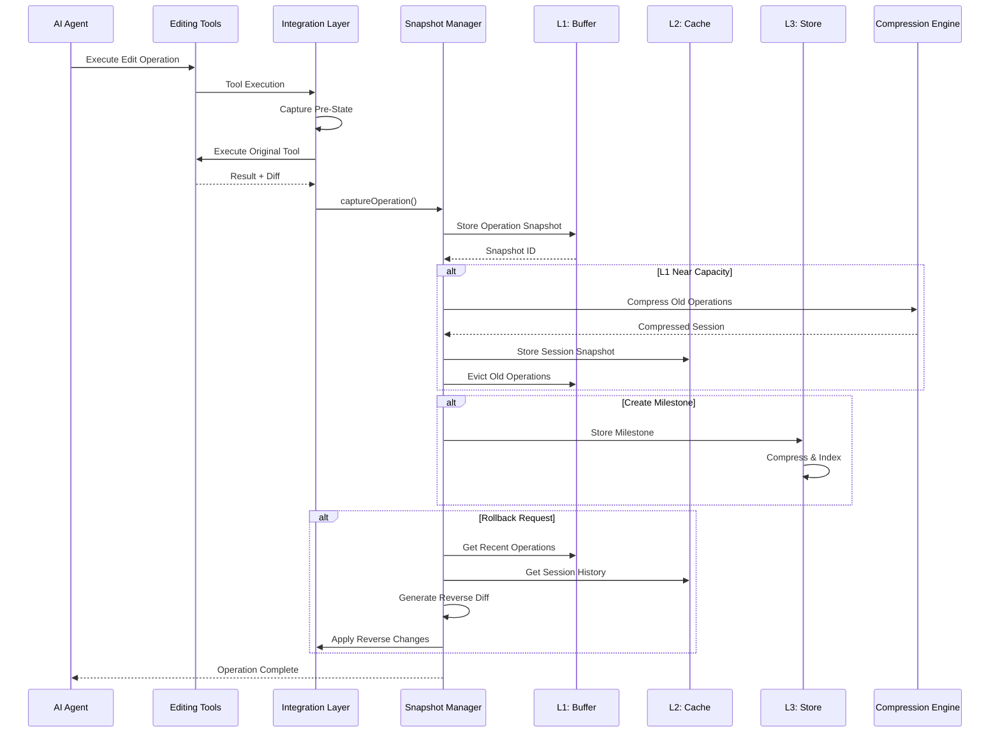

## 🧠 Compression Strategy Architecture

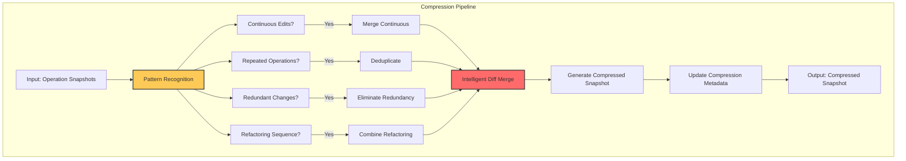

## 🌿 Branch Management Architecture

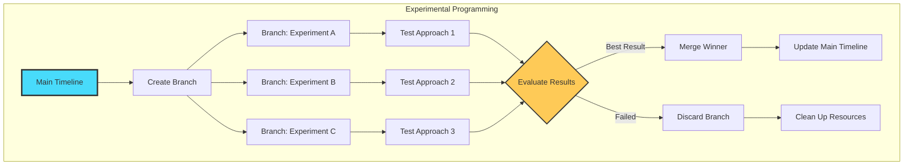

## 🎯 Tool Integration Architecture

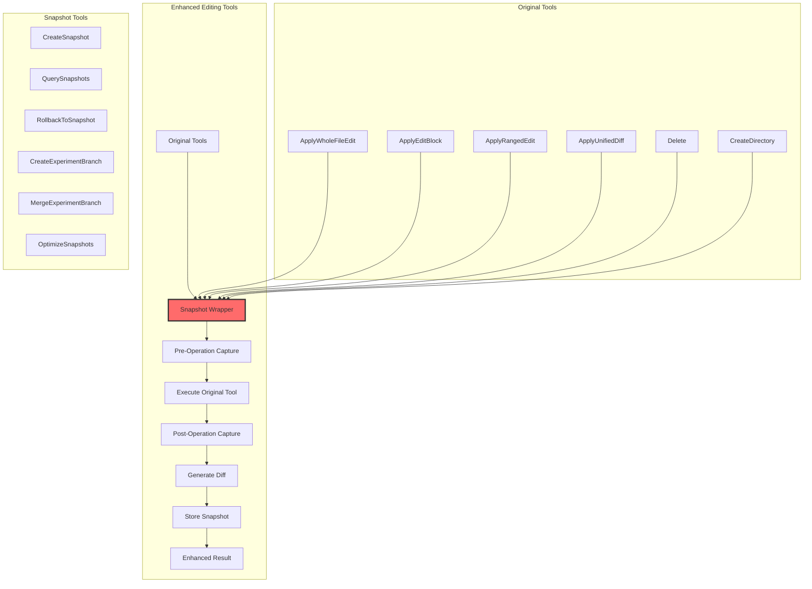

## 📈 Performance Optimization Architecture

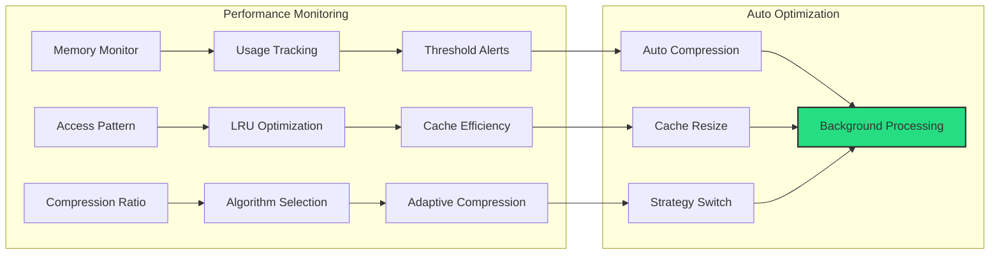

## 🔧 Event System Architecture

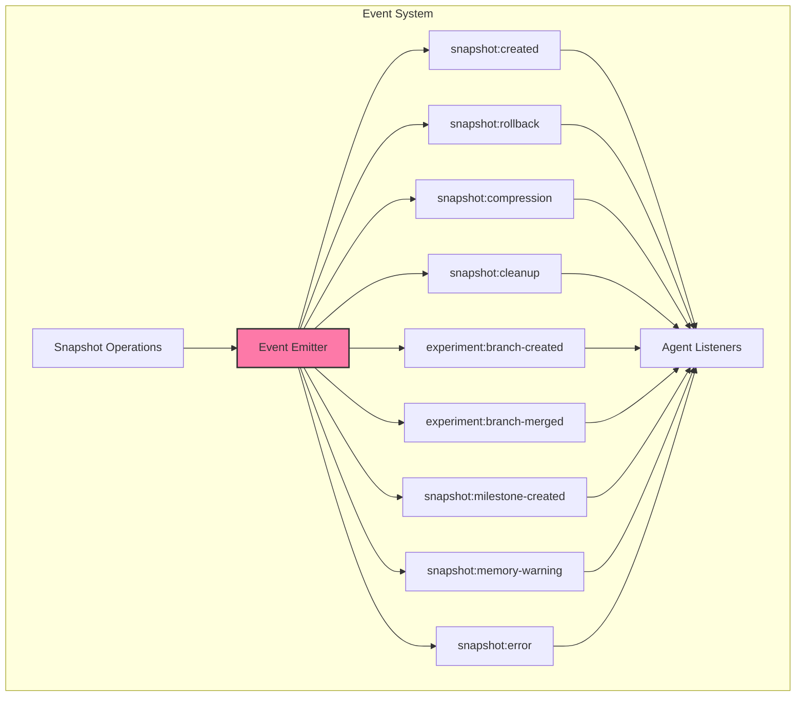

## 🎮 Auto-Rollback System Architecture

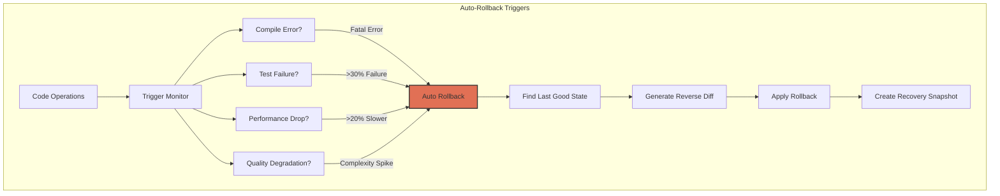

## 🏢 System Integration Points

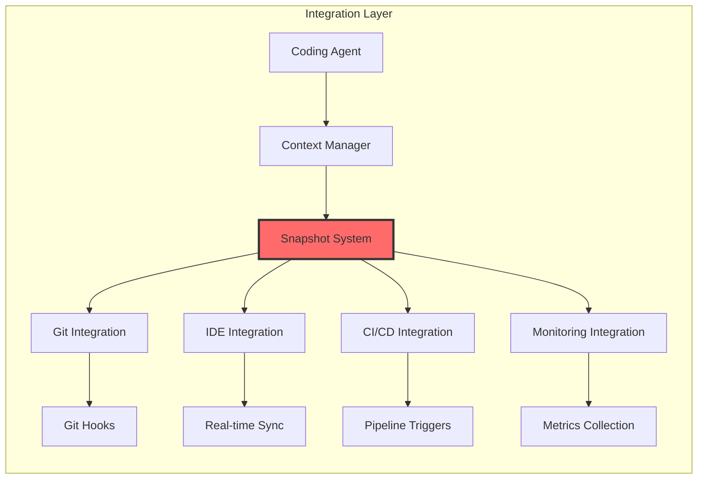

## 📊 Memory Management Strategy

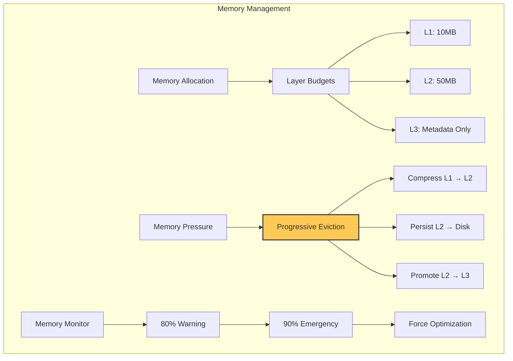

## 🔒 Data Consistency Architecture

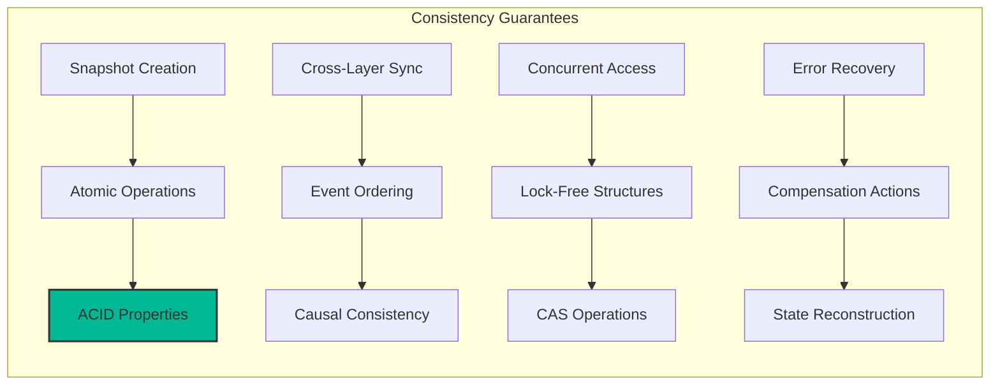

## 🚀 Deployment Architecture

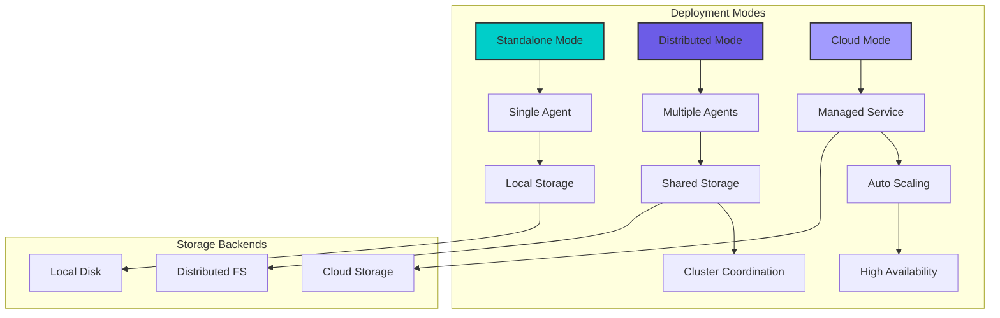

## 📋 Component Dependency Graph

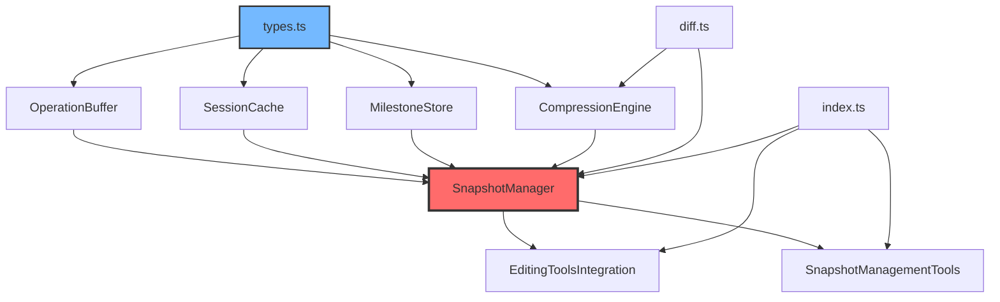

This architecture provides a comprehensive view of the Enhanced Snapshot System, showing how all components work together to provide powerful versioning, rollback, and experimental programming capabilities for AI coding agents.